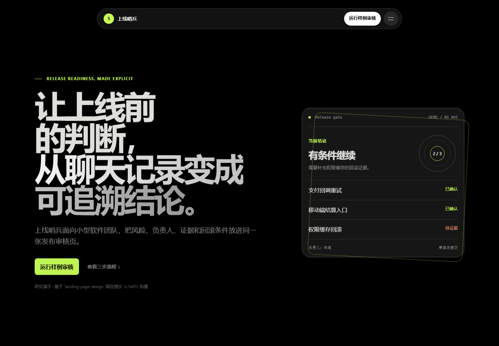
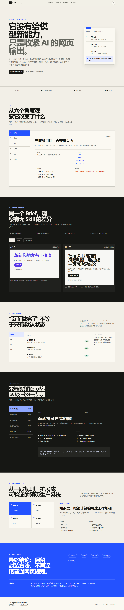
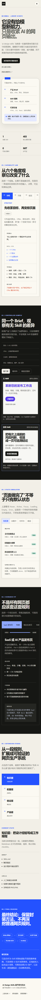

# ai-design-skills 研究

本子项目研究 [`elayadesign/ai-design-skills`](https://github.com/elayadesign/ai-design-skills)：它能给 AI 编码代理增加什么能力、依靠什么机制工作、适合哪些页面，以及怎样从一份设计规则扩展为可验证的设计工程系统。

## 一句话结论

`ai-design-skills` 不是网页组件库、动效库或生成模型，而是一份面向 AI 编码代理的通用落地页约束。它告诉代理如何询问需求、安排结构、撰写转化文案、选择视觉值并补齐交互状态；真正的 HTML、CSS、React、Tailwind 或动效代码仍由代理生成。

对于当前强模型，它没有增加新的前端技术能力：不加载这个仓库，只要需求描述充分，模型通常也能生成同等级甚至更好的页面。它剩余的主要价值是统一输出、提醒遗漏，以及示范如何把经验封装成可发现的 `SKILL.md`。如果目标是寻找高级 UI 效果、独有组件或模型原本不会的网页能力，本仓库不值得继续深挖。

## 当前研究产物

- [最有特色的实际场景：上线哨兵](web/showcase.html)
- [可操作能力演示](web/index.html)
- [浏览器验收记录](docs/web-validation.md)
- [Web 设计契约](docs/web-design-contract.md)
- [完整中文研究报告](docs/研究报告.md)
- [上游快照信息](UPSTREAM.md)
- [上游源码](upstream)
- [核心 Skill](upstream/skills/landing-page-design/SKILL.md)

## 运行能力演示

```powershell
python -m http.server 4178 --directory web
```

然后打开：

- `http://127.0.0.1:4178/showcase.html`：最有特色的完整实际场景；
- `http://127.0.0.1:4178/`：解释规则能力的研究观察台。

“上线哨兵”把 Skill 的规则真正落到一个发布审核 SaaS 页面中，演示浮动岛式导航、汉堡到 X、全屏玻璃菜单、滚动时逐词点亮的核心标语，以及可亲自运行的审核状态机。这些网页代码不是仓库自带组件，而是 AI 按仓库规则为这个场景实现的结果。



研究观察台支持：

- 策略、文案、视觉、状态、交付和边界六个能力视角；
- 同一个虚构产品 Brief 的“无 Skill / 加载 Skill”对照；
- Loading、Empty、Error 和有结果四种状态；
- 六类使用场景的适配判断与调用样例；
- 从知识层到配置、验证、产品闭环的四层扩展路径；
- 亮暗主题、键盘操作、390px 手机布局和 reduced-motion。





特色场景回归命令：

```powershell
node tests\showcase-smoke.cjs
```

当前结果：36 pass，0 fail；覆盖桌面、平板、390px 手机、键盘菜单焦点、审核状态、逐词滚动和 reduced-motion。

## 当前判断

| 问题 | 判断 |
| --- | --- |
| 能直接产生网页吗 | 不能单独运行；需要 Codex、Claude Code、Cursor 等代理读取后生成代码 |
| 能影响网页效果吗 | 能；它约束页面结构、文案、字体、间距、圆角、图标和动效 |
| 给强模型增加了新能力吗 | 基本没有；同类结果通常可以由清晰的自然语言需求直接获得 |
| 是完整设计系统吗 | 不是；它是一套强意见规则，缺少组件、Token 文件、验证脚本和设计资产 |
| 是“高转化”方案吗 | 提供常见转化原则，但仓库没有实验数据或 A/B 测试来证明转化提升 |
| 最值得借鉴什么 | `SKILL.md` 的经验封装形式，以及状态和发布检查清单 |
| 是否值得继续深入研究 | 若目标是高级前端效果或新模型能力，不值得；若研究团队约束与 Skill 工程，可作为简单案例 |

## 研究范围

本阶段完成静态源码研究与交互式能力演示，但不把该 Skill 安装为全局规则。当前“无 Skill / 加载 Skill”页面只是解释规则差异的受控样例，不证明 Skill 对当前强模型存在显著增益。研究至此结项；后续资源应优先投入可复用动效/3D 资产、私有设计系统，以及“生成—浏览器验证—自动修改”闭环。
