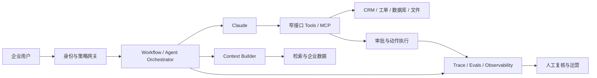

# 03｜企业 Agent 技术原理

本章回答一个核心问题：FDE 所说的 Claude 应用、MCP、Skills、子 Agent、上下文和 Evals，怎样组成一个能进入生产的系统？

## 1. 从最简单架构开始

Anthropic 区分两类 Agentic System：

- **Workflow**：模型和工具沿预先定义的代码路径执行；
- **Agent**：模型根据环境反馈动态决定下一步和工具使用。

来源：[Building effective agents](https://www.anthropic.com/engineering/building-effective-agents)。

选型顺序应当是：

```text
确定性代码
  ↓ 不足
单次 LLM + 检索/示例
  ↓ 不足
固定 Workflow（链式、路由、并行、评估-优化）
  ↓ 仍不足，且任务路径无法预定义
自主 Agent
  ↓ 单个上下文无法有效承载任务
子 Agent / 多 Agent
```

每上升一级，通常都会增加延迟、成本、调试难度和复合错误风险。判断依据不是“更先进”，而是 Evals 能否证明复杂度带来了净收益。

## 2. 参考架构



这张图中，Claude 不是系统的全部；它是受身份、策略、上下文、工具、审批和评测约束的推理组件。

## 3. 概率推理与确定性边界

### Claude 适合负责

- 理解非结构化请求；
- 对模糊信息做语义归纳；
- 在多个可用工具中选择下一步；
- 生成草稿、解释和建议；
- 对开放任务规划和恢复。

### 确定性系统应该负责

- 登录身份、授权和租户边界；
- 字段级和记录级数据过滤；
- 输入/输出 Schema 验证；
- Secrets 管理；
- 限流、超时、重试、幂等；
- 高风险动作审批；
- 审计日志和不可抵赖记录；
- 硬性业务规则和回滚。

一个实用判断是：如果某个约束必须 100% 执行，就不要只把它写在 Prompt 里。

## 4. MCP：连接而不是智能本身

Model Context Protocol 是连接 AI 应用与外部数据、工具和工作流的开放标准。官方文档把它类比为 AI 应用的 USB-C 接口。[MCP Introduction](https://modelcontextprotocol.io/docs/2026-07-28/getting-started/intro)

MCP 解决的是接口标准化问题：

- Server 暴露资源、工具或提示工作流；
- Client/Host 发现并调用这些能力；
- 同一连接能力可以被多个兼容的 AI 客户端复用。

MCP 不自动解决：

- 业务需求是否正确；
- 用户是否有权限；
- 工具是否安全；
- 模型是否会选择正确工具；
- 调用结果是否可信；
- 是否需要人工审批。

因此，“做了 MCP Server”只能证明连接能力；只有经过权限、错误语义和任务 Evals 验证，才能证明生产价值。

## 5. 工具设计：Agent-Computer Interface

Anthropic 把工具视为确定性系统与非确定性 Agent 之间的契约。[Writing effective tools for agents](https://www.anthropic.com/engineering/writing-tools-for-agents)

一个好的企业工具应满足：

### 单一清晰意图

`search_customer_cases` 比 `do_customer_operations` 更容易理解和控制。工具之间功能重叠越大，模型选择错误的概率越高。

### 明确的输入和输出

- 使用 `customer_id`，不要使用含义不清的 `user`；
- 对枚举、日期、分页和最大结果数做 Schema 约束；
- 返回 Agent 完成当前步骤真正需要的信息；
- 错误信息要告诉 Agent 能否重试以及如何修正。

### 最小权限

把读取、草稿、更新和外发分成不同工具。高风险写工具应该：

- 要求明确对象和变更字段；
- 重新检查权限，而不只依赖上游；
- 支持 dry-run 或预览；
- 使用幂等键；
- 记录调用者、参数、审批者和结果。

### Token 效率

支持搜索、过滤、分页和字段选择。一次返回整个数据库不仅浪费上下文，也扩大隐私暴露面。

## 6. 上下文工程

上下文不只是 Prompt，而是模型每次推理实际看到的全部 Token：系统指令、工具定义、外部数据、消息历史、示例和状态。

Anthropic 的指导原则是寻找能最大化期望行为概率的最小高信号上下文。[Effective context engineering for AI agents](https://www.anthropic.com/engineering/effective-context-engineering-for-ai-agents)

### 常见策略

- 系统指令保持具体、直接，但不要把所有逻辑硬编码进去；
- 使用少量多样、典型的示例，不堆积所有边缘案例；
- 通过索引、文件路径、查询标识等轻量引用按需加载信息；
- 让 Agent 先搜索元数据，再读取最相关内容；
- 长任务使用压缩、结构化笔记或隔离的子 Agent 上下文；
- 定期删除已经无用的工具输出和重复信息。

### 常见失败

- 把“长上下文”误解为“把所有材料一次放进去”；
- 工具过多且职责重叠；
- 检索返回大量无关文本；
- 对话历史一直增长，没有压缩或状态抽取；
- 混合不同客户、权限域或任务的上下文。

## 7. Agent Skills

在本研究中，Skill 指可复用的领域能力包：指令、流程知识、参考材料和必要代码共同描述“怎样稳定完成某类任务”。它适合沉淀：

- 受监管报告的固定生成流程；
- 客户组织内部的术语和政策；
- 一套工具应该如何组合；
- 输出模板和质量检查；
- 特定领域的边界与升级规则。

Skill 与 MCP 的侧重点不同：

- MCP 更像“可以连接和调用什么”；
- Skill 更像“遇到某类任务应该怎样工作”。

两者可以组合：Skill 指导 Agent 何时、以什么顺序和标准使用 MCP 工具。

## 8. 子 Agent 与多 Agent

子 Agent 的主要价值不是制造更多“智能角色”，而是：

- 隔离不同任务的上下文；
- 让独立搜索或分析并行；
- 为专业任务提供不同工具和指令；
- 避免主 Agent 被大量中间材料污染。

适合的任务：多个相互独立的研究分支、跨文件代码修改、不同专业维度的审核。

不适合的任务：步骤简单、状态强耦合、通信成本高于并行收益，或者一个 Workflow 已能可靠完成。

多 Agent 增加的新风险包括：任务重复、冲突写入、证据丢失、责任不清、总成本上升和错误相互放大。因此需要明确所有权、共享状态协议、停止条件和汇总验证。

## 9. Evals：如何知道系统真的工作

Anthropic 将 Agent Eval 拆成几个基本对象：[Demystifying evals for AI agents](https://www.anthropic.com/engineering/demystifying-evals-for-ai-agents)

- **Task**：带输入和成功标准的测试问题；
- **Trial**：一次具体运行；
- **Grader**：对结果某一维度进行评分的逻辑；
- **Transcript/Trace**：输出、工具调用和中间步骤的完整记录；
- **Outcome**：运行后环境的最终状态；
- **Harness**：运行、记录、评分和汇总的基础设施；
- **Suite**：针对某项能力的一组任务。

### 三类评分器

| 类型 | 适合检查 | 风险 |
| --- | --- | --- |
| 代码评分器 | Schema、数据库状态、权限、工具参数、测试 | 可能过于刚性 |
| 模型评分器 | 语气、相关性、解释质量、主观 Rubric | 需要人工校准，可能不稳定 |
| 人工评分 | 高风险判断、领域质量、最终校准 | 慢、贵、难以高频执行 |

### 结果优先但不忽略轨迹

Agent 可能用意外但有效的路径完成任务，因此不要把唯一调用顺序写死为通过条件。但安全要求仍然需要检查轨迹，例如是否访问了未授权数据、是否调用了禁止工具。

### 非确定性指标

- `pass@k`：k 次中至少一次成功，适合允许多次尝试的探索型任务；
- `pass^k`：k 次全部成功，适合强调一致性的客户流程。

对客户可见、每次都必须可靠的 Agent，只展示“多试几次总能成功”是不够的。

### 从 20–50 个任务开始

Anthropic 建议早期不必等待数百个样本，可以先把 20–50 个真实、清晰的任务或失败案例转成初始套件，然后持续加入生产问题。任务必须可解、标准明确，并有参考解验证评分器本身。

## 10. 安全与可靠性威胁模型

| 风险 | 例子 | 主要控制 |
| --- | --- | --- |
| 越权读取 | 普通员工检索管理层文档 | 用户身份透传、ACL 过滤、最小字段返回 |
| Prompt Injection | 文档诱导 Agent 外发 Secrets | 指令/数据分离、工具权限、内容隔离、检测与审批 |
| 越权写入 | Agent 修改未批准字段 | 窄写工具、字段白名单、审批、幂等与审计 |
| 幻觉 | 编造政策或引用 | 来源约束、引用检查、无法确认时升级 |
| 循环与成本失控 | 两个工具之间反复调用 | 最大步数、预算、重复检测、停止条件 |
| 数据泄漏 | 把不必要 PII 放入模型上下文 | 数据最小化、脱敏、区域/保留策略 |
| 误报成功 | 回复“已完成”但后台未改变 | 检查真实最终状态，不只检查自然语言 |
| 模型升级退化 | 新模型改变工具选择 | 固定 Eval Suite、A/B、逐步发布、回滚 |

## 11. 上线策略

企业 Agent 的权限应逐级开放：

1. **影子模式**：运行但不影响用户，只比较历史结果。
2. **只读辅助**：检索与总结，不改变外部状态。
3. **草稿模式**：生成建议，由人决定是否提交。
4. **审批写入**：Agent 提议动作，经确认后执行。
5. **有限自治**：仅低风险、可逆、可观察动作自动执行。

每一级都要定义进入条件、暂停条件和回退路径。采用率低也可能意味着流程设计失败，即使离线准确率很高。

## 12. 可扩展方向

- **行业化**：把金融、医疗、制造规则沉淀为 Skills、Evals 和审批策略。
- **平台化**：复用身份、工具网关、Trace、评测和发布基础设施。
- **模型路由**：按风险、成本和难度选择模型，并用同一套 Evals 核验。
- **工具生态**：将成熟连接器标准化为 MCP Server，但保留客户级权限策略。
- **持续评测**：在 CI/CD、生产监控、A/B 和人工校准之间形成闭环。
- **反馈产品**：把多个客户反复需要的功能上升为 Claude 平台能力。

扩展的前提不是“系统可以加入更多 Agent”，而是新增复杂度能通过业务指标和 Evals 证明价值。
