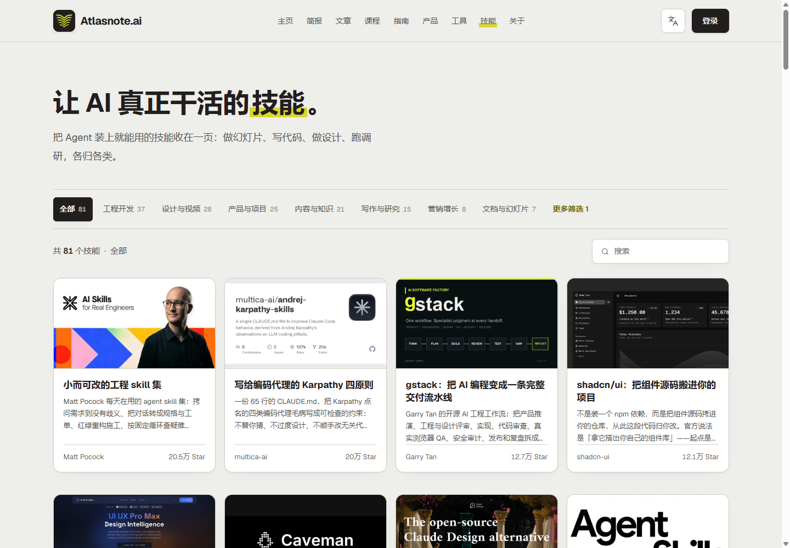
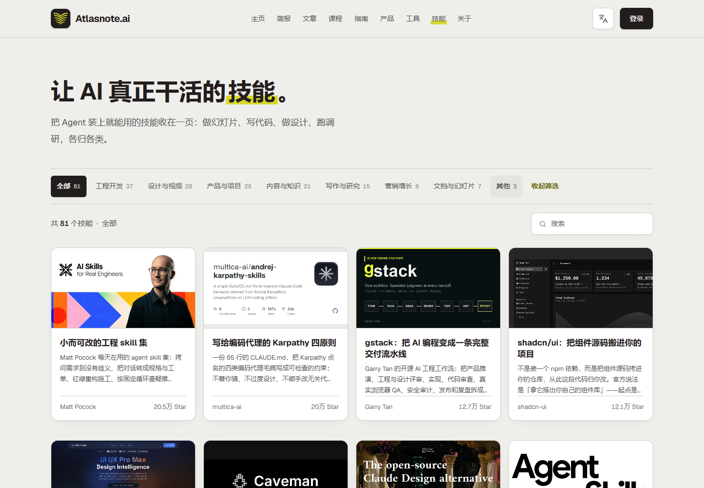
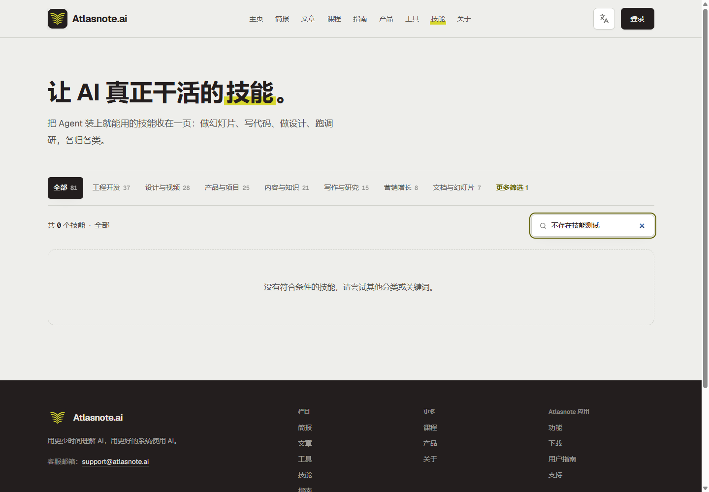
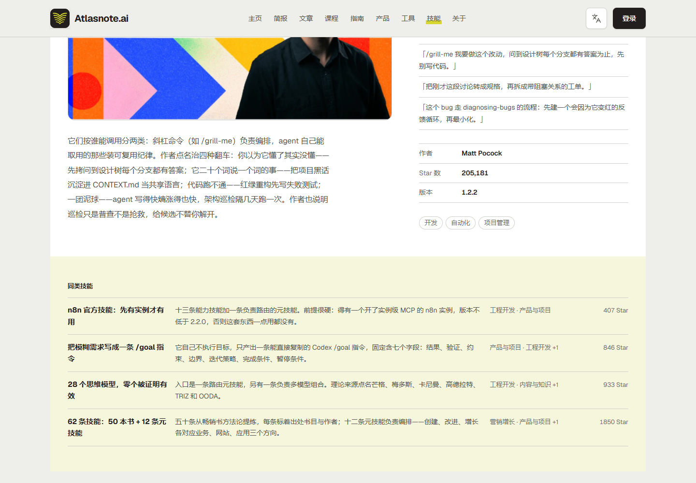
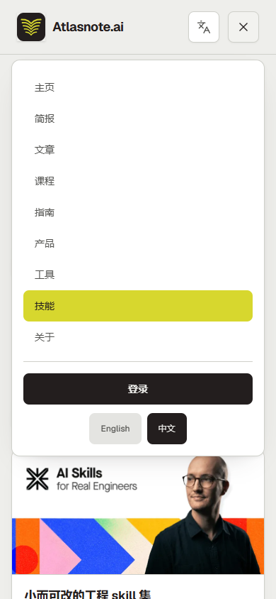

# 页面结构与工作原理

## 1. 产品角色

Atlasnote Skills 页不是技能运行器。它位于用户和原始开源项目之间，承担四个中介角色：

1. **收录**：把分散在不同作者和仓库中的项目放进同一目录。
2. **翻译**：把仓库术语改写成中文结果语言。
3. **分类**：用用户任务而非代码语言组织项目。
4. **导流**：把已经形成兴趣的用户送到原始 GitHub 仓库。

这决定了页面的核心指标不是“模型执行成功率”，而是“用户多快找到值得进一步检查的候选”。

## 2. 目录页区域



### 2.1 全站导航

导航包含主页、简报、文章、课程、指南、产品、工具、技能和关于。它表明 Skills 是 Atlasnote 内容体系的一部分，而非独立应用。

右侧语言和登录入口说明网站希望覆盖中英文内容与账户能力；但在当前未登录浏览路径中，登录与技能筛选、收藏或个性化之间的价值关系并不明显。

### 2.2 页面定位区

标题“让 AI 真正干活的技能”负责把抽象的 Skill 转成结果承诺；副标题列出幻灯片、代码、设计和调研，负责降低新用户理解门槛。

优势是直接、没有术语堆积。风险是“装上就能用”容易被理解为当前网页提供直接安装或执行，而页面实际只提供信息和 GitHub 跳转。

### 2.3 一级分类

本次观察到的分类如下：

| 分类 | 数量 | 主要意图 |
| --- | ---: | --- |
| 全部 | 81 | 展示完整目录 |
| 工程开发 | 37 | 编码、测试、调试、架构、发布 |
| 设计与视频 | 28 | UI、视觉、动效、插画、视频 |
| 产品与项目 | 25 | 需求、规划、任务拆解、项目管理 |
| 内容与知识 | 21 | 知识库、内容生产、信息管理 |
| 写作与研究 | 15 | 调研、论文、写作、证据整理 |
| 营销增长 | 8 | SEO、转化、广告、留存、销售 |
| 文档与幻灯片 | 7 | PPT、Word、PDF、网页演示 |
| 其他 | 3 | 无法归入主要任务分类的项目 |

各分类数量相加超过 81，是因为同一项目可以带多个分类。详情页的多个标签也支持这一点。页面没有直接解释“分类可重叠”，新用户可能把数量理解成互斥分组。

### 2.4 更多筛选



“更多筛选 1”实际表示还有一个被隐藏的分类；展开后显示“其他 3”。数字 1 更像“当前应用了一个筛选条件”，存在语义歧义。

如果未来增加客户端、许可证、安装难度、依赖或内容形态等维度，“更多筛选”才会真正成为决策工具。当前它只是为导航行节省宽度。

### 2.5 搜索与结果上下文

搜索为即时筛选，不需要提交按钮。结果数量会跟随输入更新。


搜索 `PPT` 返回三个方向不同的候选：原生 PowerPoint、网页幻灯片和固定视觉系统的网页 PPT。这很好地体现了目录价值：同一个用户词汇可以映射到不同实现路线。



零结果状态提供了明确解释和调整建议，这是成熟的空状态处理。不过计数行显示成类似“共 0 个不存在技能测试”，查询词与数量上下文拼接得不自然，应改为：

```text
“不存在技能测试”没有匹配结果
```

或：

```text
共 0 个技能 · 搜索“不存在技能测试”
```

### 2.6 卡片网格

每张卡片包含：

- 预览图；
- Atlasnote 编辑标题；
- 一段结果导向摘要；
- 作者；
- Star 数。

统一卡片让来源不同的项目可以快速比较。图像承担识别作用，标题和摘要承担判断作用，作者与 Star 承担初步信任作用。

当前缺少的核心字段是“项目类型”。例如框架、CLI、MCP、模板库和真正的 Agent Skill 被放在相同卡片结构里，用户可能无法预判安装与使用成本。

## 3. 详情页结构


详情页按以下顺序组织：

1. **交付什么**：先说最终改变，而不是技术构成。
2. **标题与收录日期**：确认对象和内容时点。
3. **编辑摘要**：说明核心工作方法。
4. **分类标签**：放回目录体系。
5. **GitHub CTA**：进入原始来源。
6. **预览图**：帮助识别项目。
7. **适合谁**：开发者、职场人士、创业者等。
8. **这样用它**：给出可直接理解的调用示例。
9. **详细解读**：解释内部机制与使用边界。
10. **元数据**：作者、Star、版本、主题标签。
11. **同类技能**：继续探索相关项目。



这是一个“结果优先”的编辑结构，适合非维护者快速理解仓库。但详情页仍然缺少从“理解”走向“安全试用”的决策层：

- 支持哪些 Agent 客户端；
- 是否需要 MCP、CLI、API Key 或登录；
- 安装到用户级还是项目级；
- 是否包含可执行脚本；
- 网络、文件和密钥权限；
- 许可证；
- 最后一次人工验证；
- 最小试用命令；
- 可复现的成功与失败案例。

## 4. 移动端结构


移动端将全站导航折叠为菜单，把分类换行显示，把搜索移动到结果摘要下方，并把四列卡片变为单列。核心顺序没有改变，因此用户无需重新学习。



移动菜单将站点导航、登录和语言放进同一面板。当前页面仍在面板后方可见，视觉上能保持上下文；但仅凭截图不能确认键盘焦点是否被限制在菜单内、背景内容是否对屏幕阅读器设为不可交互。


详情页在移动端将交付承诺、标题、摘要、标签、CTA 和预览图顺序排列，重点保持完整。桌面端右栏的“适合谁”和“这样用它”进入下方，符合响应式重排逻辑。

## 5. 数据与内容工作原理

根据公开页面可确认的工作方式是：

```text
发现原始项目
→ 阅读和验证公开资料
→ 写中文编辑标题与摘要
→ 添加分类、受众、示例和元数据
→ 发布目录卡片与详情页
→ 链接原始 GitHub
```

Atlasnote 的关于页称创建者会持续研究并亲自验证工具、Agents、Skills 和工作流。该说法说明内容采用编辑策展模式，但不能等同于独立安全审计、持续兼容性测试或实时数据同步。

页面显示了 Star 与版本，却没有标明数据抓取时间。用户应把这些字段视为参考快照，而不是实时质量证明。

## 6. 页面与 Skill 运行的边界

Skill 的典型运行链路是：

```text
Agent 发现 Skill 的名称和描述
→ 任务匹配时加载 SKILL.md
→ 按需读取脚本、参考资料和模板
→ 使用 Agent 已拥有的终端、文件、浏览器或 MCP 工具执行
```

Atlasnote 页面只覆盖链路之前的“发现与理解”。它不自动授予工具、账号或文件权限，也不证明某个 Skill 能在用户的具体环境中工作。
