# genart-skill 线条生成艺术演示与研究

> **归档状态：暂时归档（2026-08-31）。** 源码研究、Windows 兼容实验、交互式 Web、项目内 Codex Skill 和浏览器验收已经形成可复现快照；当前不再继续增加艺术生成器。若上游协议或脚本发生重要变化，或需要为真实 Canvas/WebGL 项目接入确定性质量门，再恢复本项目。

[在线打开 Genart Lab](https://yydshly.github.io/0830_codex_project/demos/genart-skill-research/) · [查看原库 `camilleroux/genart-skill`](https://github.com/camilleroux/genart-skill) · [查看 GitHub 子项目](https://github.com/yydshly/0830_codex_project/tree/main/projects/genart-skill-research) · [查看归档总结](docs/archive-summary.md)

## 先用一句大白话理解

**在我们这个演示里，可以先把它理解成：一个指导 AI 用代码制作线条艺术的 Skill。**

你输入一个作品编号（seed），网页就画出一张线条图；换一个编号会得到另一张图，重新输入原来的编号又能画回原图。它还可以一次预览很多张、检查结果有没有乱变，并导出图片。

但要把两件事分开：

| 组成部分 | 它实际负责什么 |
| --- | --- |
| `genart-skill` 原库 | 给 AI 一份生成艺术制作说明和检查工具，告诉它怎样写、怎样保证结果可以重画、怎样批量检查。 |
| 本项目的线条生成器 | 真正画出当前看到的曲线、光带、颜色和排版；这是我们为了演示而写的。 |
| 浏览器 | 执行绘图代码，让你换编号、看效果、重复检查和下载文件。 |

所以最简单的回顾方式是：**原库提供“怎么做和怎么检查”，我们提供“具体画什么”。当前具体画的是极简线条艺术。** 原库并不只限于线条；把绘图代码换掉，也可以做粒子、几何图案、地图、怪物外观或其他程序化视觉。

## 这个演示能让你直接看到什么

1. 输入一个编号，生成一张线条艺术图。
2. 用同一个编号重复生成，画面保持不变。
3. 换一个编号，得到同一风格下的新作品。
4. 一次查看一组作品，判断整个系列是否协调。
5. 故意改成不稳定随机数，直接看到同一编号为什么会画出不同结果。
6. 下载 PNG、SVG 和记录生成参数的 Manifest。

复杂的 seed、PRNG、Playwright 和 traits 只是实现以上体验的技术手段；第一次回顾本项目时不需要先理解这些名词。

## 再往下一层理解原库

[`camilleroux/genart-skill`](https://github.com/camilleroux/genart-skill) 不是一个自动画图模型。它更像给 Claude Code 准备的“制作说明书 + 检查工具”：

1. 用 Skill 和参考资料告诉编码代理，怎样设计可复现、可批量发行的生成艺术；
2. 用一个极小的作品接口，把不同 Canvas/WebGL 项目接到同一套测试工具；
3. 用 Playwright 真实运行作品，检查确定性、批量观察 seed、统计 features，并导出 PNG。

最容易误解的一点是：安装这个 Skill 不会自动多出一种画风。AI 仍然需要根据任务编写绘图代码，浏览器负责把代码画出来，创作者负责判断作品是否好看。

完整拆解见 [《源码与实验研究报告》](docs/源码与实验研究报告.md)。上游源码固定在提交 [`3380ebc`](UPSTREAM.md)。

## 先看 Web，再看代码

这次交付不再只是一份研究报告，而是一间可以亲手操作的 **Genart Lab**：

- 在首屏修改或重放 seed，观察同一个 hash 如何回到同一张作品；
- 切换到 `Math.random` 故障模式，运行 3 次真实 Canvas 像素检查，看 PASS 变成 FAIL；
- 同时观察 12 个确定性 seed，不再用一张“英雄图”代表整个系列；
- 在浏览器中抽取 5,000 个 seed，把 traits 的目标权重与实际分布并排比较；
- 跟随一次真实“玩家坏地图”事件，完成三次重放、规则修复、身份保持和 10,000 seed 发布普查；
- 从玩家客服、技术美术、游戏工程、QA 数据、制作发行和适用边界六个角色角度，观察同一事件的输入、证据与决策；
- 进入“从引擎到产品”舞台，直接切换可玩关卡、品牌多画幅、个性包装、数据报告、媒体栏目和 UI 身份六种最终交付；
- 在品牌案例中编辑品牌名、活动标题、活动 ID 和两组颜色，观察业务参数怎样立即进入确定性渲染；
- 运行“有 Skill / 无 Skill”三次对照，并下载当前参数对应的 PNG、SVG 与生产 Manifest；
- 在六个真实场景之间切换，用同一 seed 生成游戏地图、装备、怪物、品牌海报、数字艺术和回归差异；
- 下载 PNG、切换分辨率/主题，并复制项目内 Skill 的直接使用命令。

```powershell
npm install
$env:GENART_PORT = "4197" # 可省略；默认端口为 4173
npm run web
```

然后打开 `http://127.0.0.1:4197`。Pages 构建会把同一套静态页面发布到 [`demo_url`](https://yydshly.github.io/0830_codex_project/demos/genart-skill-research/)。

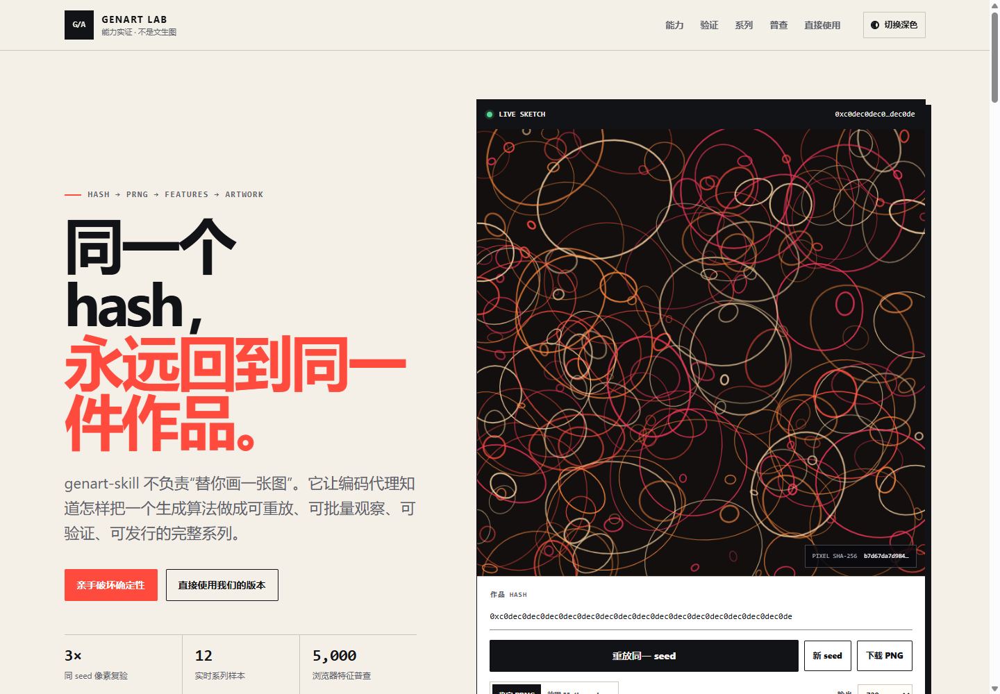

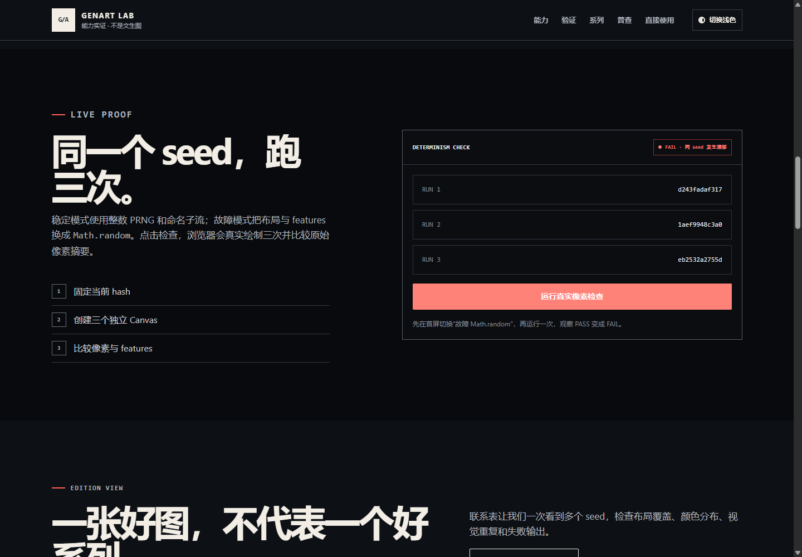

## 一个完整场景：玩家遇到无法通关的地图

玩家只提交世界 seed：`0xc0de…c0de`。页面用这个 seed 恢复第 7 个房间被墙封死的现场，而且一起恢复当时的怪物、稀有护盾和冷色雾效。随后可以按顺序完成：

1. **重放**：运行三次得到相同 Canvas SHA-256，证明问题稳定存在，不是随机漂移；
2. **隔离**：`world`、`enemy`、`loot`、`vfx` 使用命名子流，定位到错误只在 route 规则；
3. **修复**：候选版本恢复出口，但怪物 ID 和掉落 ID 仍与玩家现场相同；
4. **普查**：旧规则在 10,000 个世界中产生 809 个封路 seed，候选规则降为 0。

这里的“艺术效果”不是库附赠的一种画风。地图、怪物、宝箱和雾都是案例生成算法的视觉输出；这个库真正增加的是：让视觉结果可通过 seed 寻址、可稳定重建、可拆分演进，并能从单张画面扩展到整个系列的质量证明。

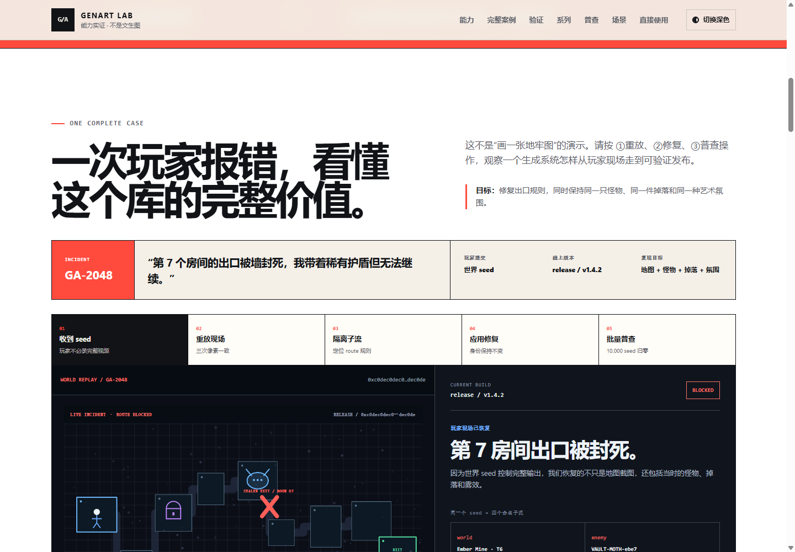

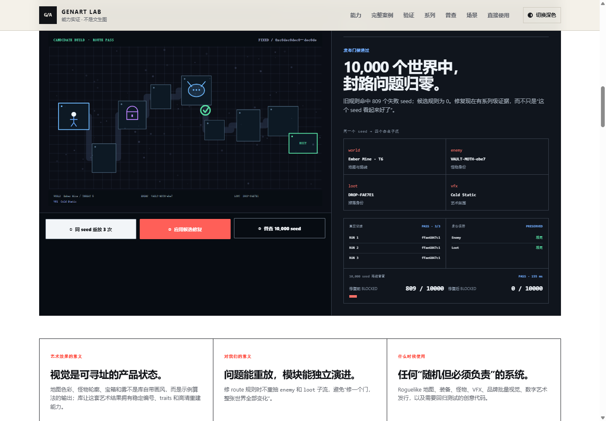

## 同一个事件，再从六种角色角度看

完整案例回答“系统怎样解决问题”，沉浸式 seed 舞台继续回答“这件事分别对谁有价值”。Canvas 占据主舞台；六个角色仍读取同一个 seed 和事件 GA-2048，但会实时重建六幅构图不同的视觉现实：玩家现场、艺术流体、子流轨道、批量扫描、发行画廊和选型宇宙。输入、证据和决策只作为画面前景 HUD：

| 角色角度 | 收到什么 | 关键证据 | 最终决策 |
| --- | --- | --- | --- |
| 玩家 / 客服 | seed、版本、一句话描述 | 3 次重放一致、完整现场恢复 | 升级为可复现规则缺陷 |
| 技术美术 | 艺术方向、traits、允许变化范围 | Palette / Silhouette / Atmosphere 保持 | route 修复无需重新艺术评审 |
| 游戏工程 | 根 seed、子流命名、模块版本 | 只有 `world.route` 改变 | 缩小代码与回归范围 |
| QA / 数据 | fixture、像素摘要、路线不变量 | 3/3 重放 + 10,000 seed 普查 | 候选版本通过发布门禁 |
| 制作 / 发行 | build、资产清单、审批规则 | seed / traits / digest / audit 可追溯 | 签署候选并保留回滚坐标 |
| 适用边界 | 是否程序化、系列化、需负责 | 重放 / 批量 / 规则审查条件 | 一次性图片不用，生成系统才用 |

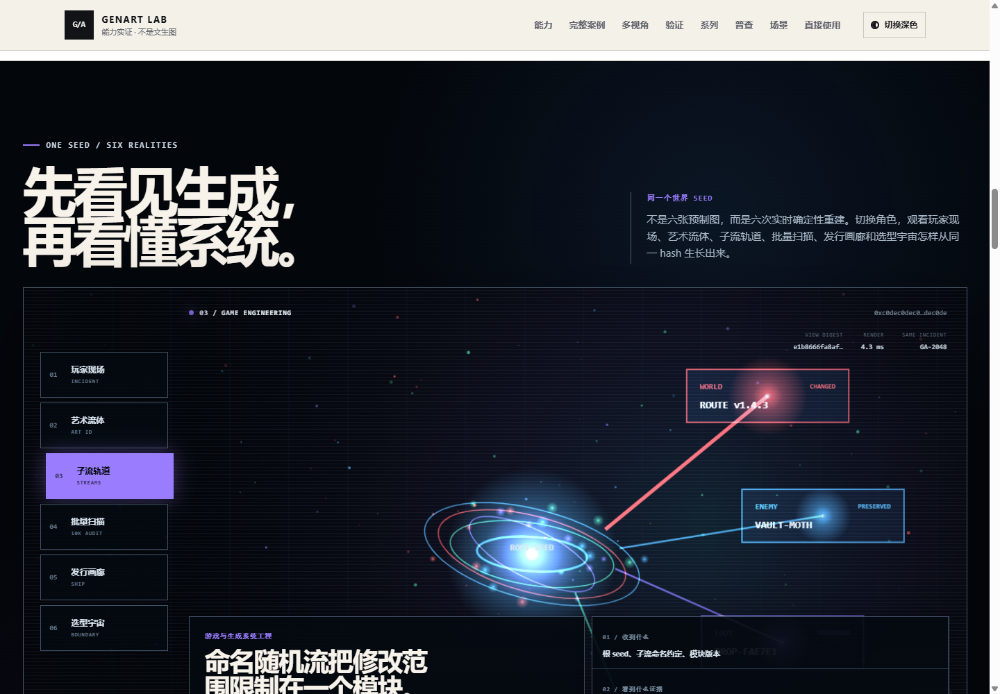

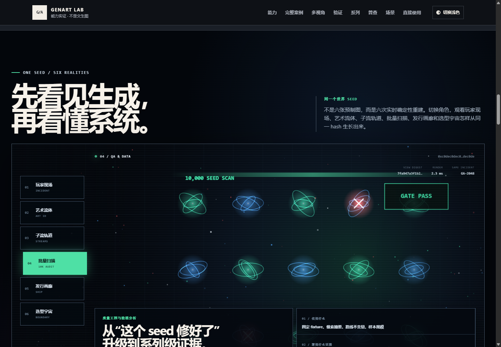

## 从生成引擎到六种真实产品

抽象艺术舞台负责证明“同一个 seed 可以稳定控制复杂视觉”，产品落地舞台则把这件事继续推进到真实消费表面。六个案例都由 `application-core.js` 在浏览器中实时绘制，不是静态示意图：

| 产品案例 | 直接看到的最终结果 | 产品真正消费的内容 |
| --- | --- | --- |
| 游戏关卡 | 俯视地图、玩家、敌人、掉落、出口和 HUD | Tilemap JSON、实体配置、预览图 |
| 品牌活动 | 桌面 KV、9:16 Story、商品卡 | SVG、PNG、CMS 配置 |
| 个性商品 | 包装盒、瓶身标签、专属纹样、订单编号 | 印刷 SVG、CMYK PDF、订单 JSON |
| 数据报告 | 年度封面、指标卡、趋势图、地区摘要 | PDF、SVG 图表、分享图 |
| 媒体内容 | 播客封面、播放器、视频缩略图、栏目资产 | 1:1/16:9 图片、动态参数 |
| UI 身份 | 头像、会员卡、徽章和主题颜色 | CSS tokens、SVG badge、Profile JSON |

“重放同一 Seed”会得到完全相同的像素摘要；“换 Seed 看变体”会同时更新六个产品表面。这里展示的重点不是某一种固定画风，而是业务输入怎样被稳定转换成可以被产品、生产或内容系统消费的资产。

### 品牌案例已经是一条可操作的生产闭环

选择“品牌活动”后，页面会继续展开一张生产台，而不是停在成品 mockup：

1. **模型负责设计**：AERO/NOVA 的构图、颜色逻辑、渠道安全区和 Canvas/SVG 代码来自本项目为演示所做的创意实现，不是上游库附赠的画风；
2. **库的方法负责稳定**：Seed、命名随机流、重放、批量检查和交付协议让同一业务输入可以再次生成同一结果；
3. **浏览器负责执行**：修改五项品牌参数后，本地代码立即重绘，不再次调用模型，并计算真实 RGBA 像素 SHA-256；
4. **生产系统得到文件**：PNG 是当前多画幅 Canvas，SVG 是可继续编辑的桌面 KV，Manifest 记录 seed、品牌输入、三个渠道输出和像素摘要。

页面现在把原理直接拆成三层：第一层是模型或创作者编写的生成器，当前配方只有 seeded PRNG、贝塞尔曲线、径向渐变和字体排版；第二层是 genart-skill 提供的 Seed、命名子流、浏览器检查与批量普查方法；第三层是浏览器实际绘制、计算摘要并导出文件。因此换成粒子流场、几何拼贴、版画、字体生成、3D Shader 或程序化地形时，艺术效果会改变，但方法与验收层仍然成立。

页面中的并排实验会用相同 Seed 连续生成三次：左侧 seeded stream 得到 1 个摘要并显示 PASS，右侧 `Math.random` 得到多个摘要并显示 DRIFT。它直观回答了“这个艺术效果对实际场景有什么意义”：意义不在某条曲线，而在同一活动能否被重做、追责、批量适配和进入 CMS/印刷/自动化流水线。

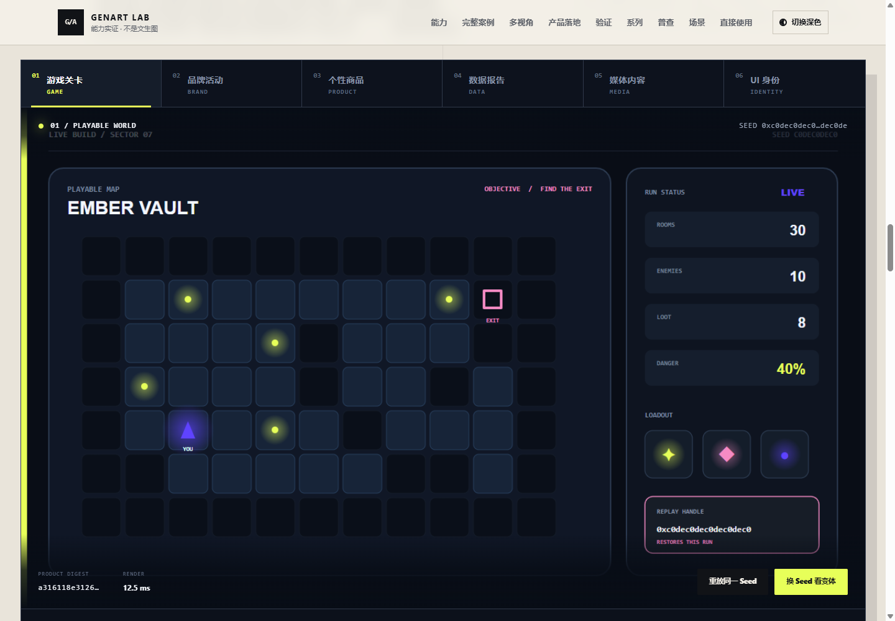

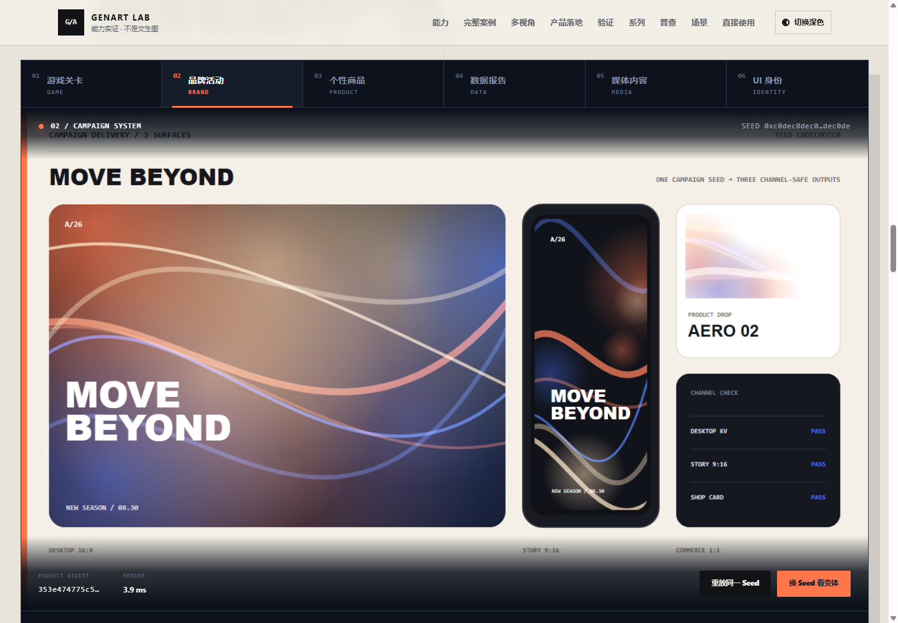

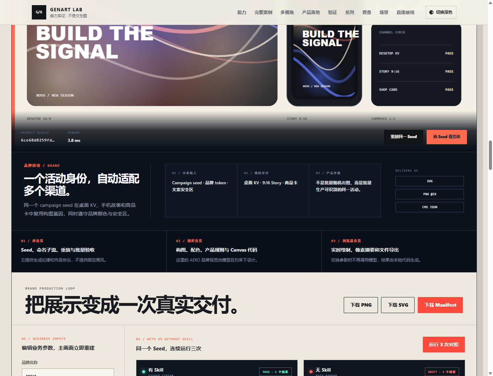

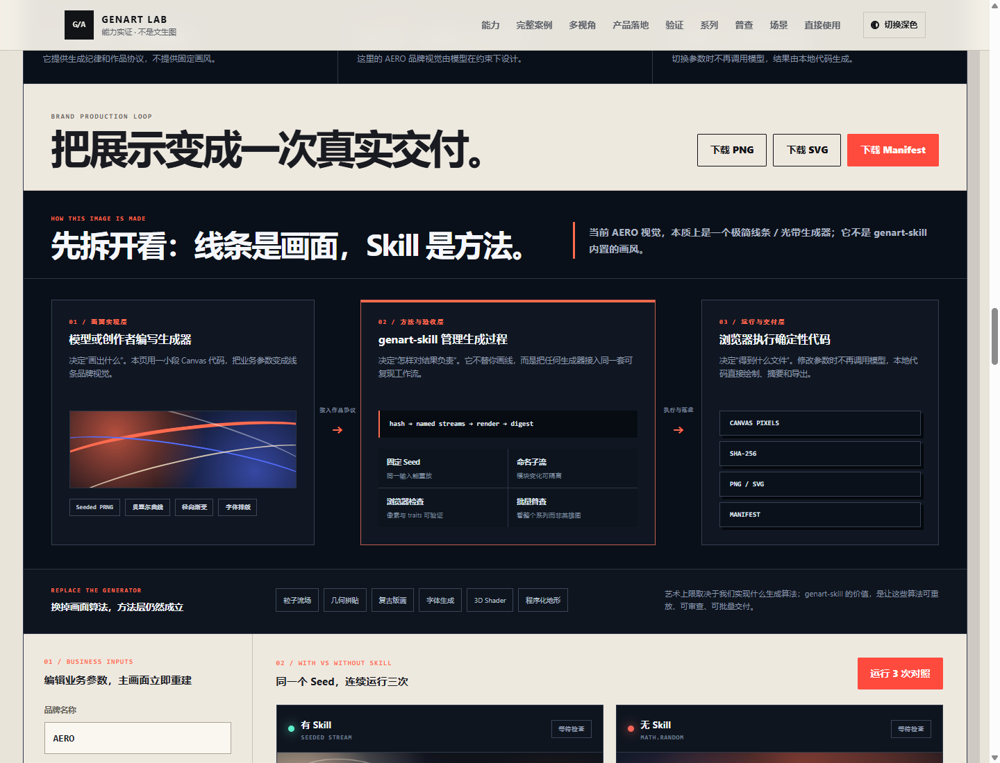

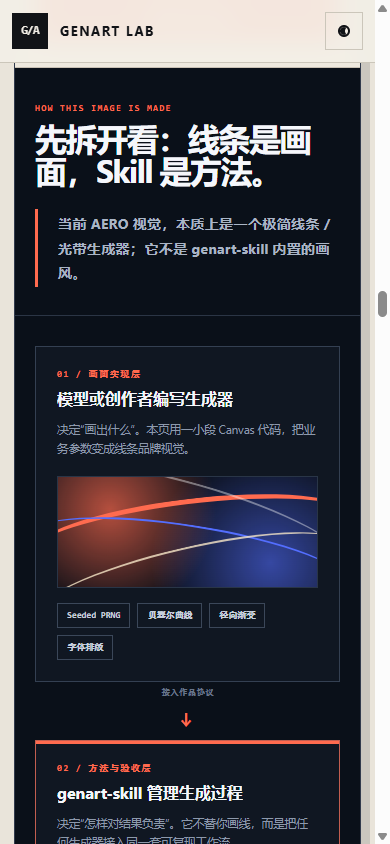

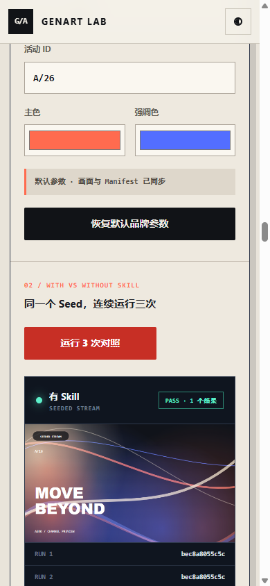

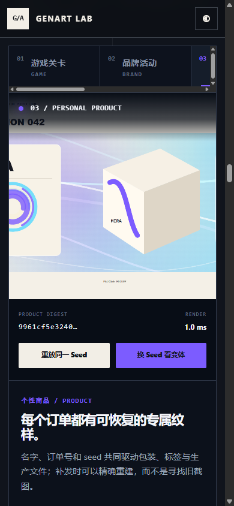

## 六种使用场景，不再只看抽象圆圈

场景图谱中的六个 Canvas 使用同一个外部 seed，但各自拥有独立命名随机流。每个案例同时回答输入、生成输出、traits、验收方法、团队价值、扩展方向和诚实边界。

| 场景 | 现场生成什么 | 最关键的验证 | 对我们的直接价值 |
| --- | --- | --- | --- |
| 游戏地图 | 房间、走廊、起终点、危险等级 | 连通性、固定 seed、A-B-A | 玩家只报告 seed 即可恢复坏地图 |
| 装备掉落 | 类型、稀有度、属性、词缀 | 大样本概率 census | 验证真实掉率和非法组合 |
| 怪物外观 | 轮廓、附肢、眼睛、变异 | 轮廓联系表和视觉回归 | 外观、AI、招式使用独立子流 |
| 品牌视觉 | 海报版式、图形、色彩、安全区 | 多渠道联系表 | 同一活动批量扩展一致素材 |
| 数字发行 | 唯一作品、traits、edition 信息 | rarity census 和高分辨率重放 | 发行前看整个系统而非英雄 seed |
| 系统质检 | 基线/候选画面和差异状态 | 像素、features、批量 fixture | 将创意代码纳入 CI 和 PR 审查 |

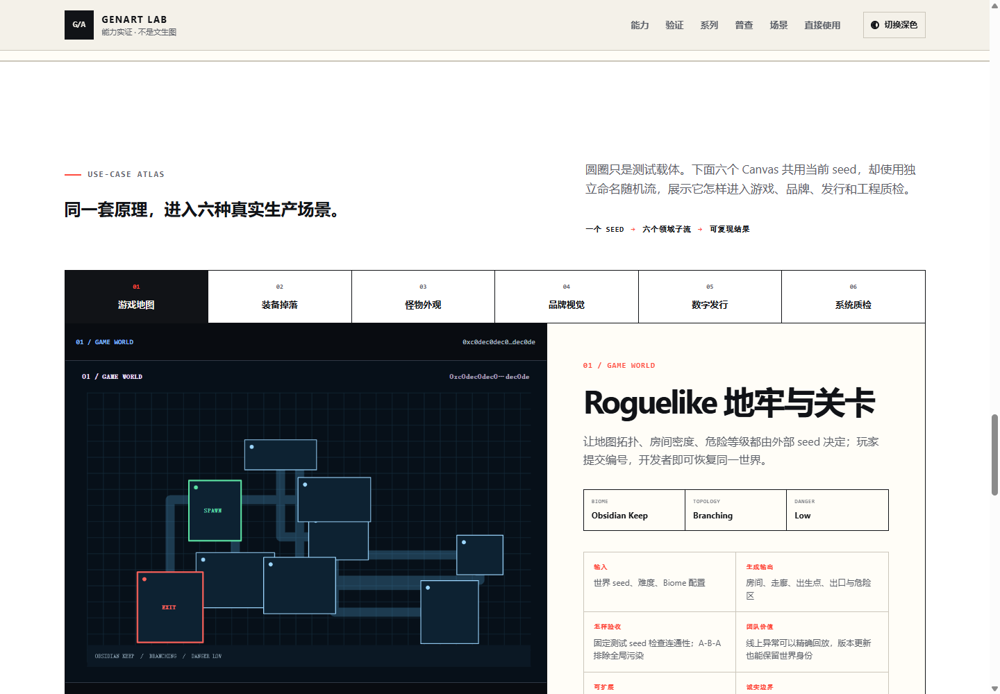

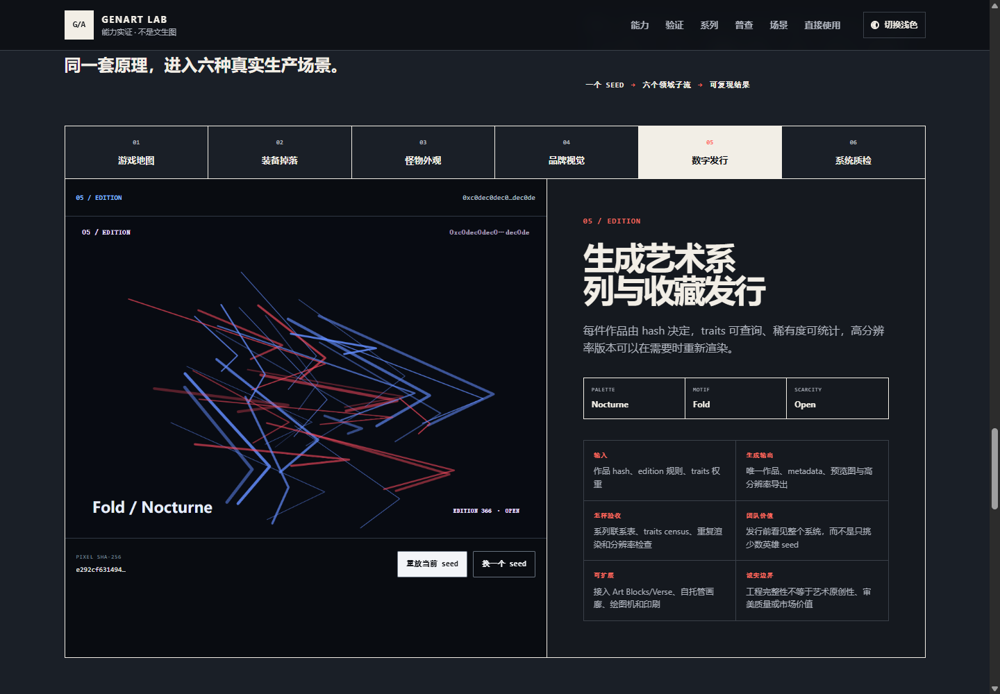

## 已转成我们能直接使用的能力

项目内的 [`skills/genart-studio`](skills/genart-studio/SKILL.md) 是 Codex 原生 Skill 版本。它保留了上游关于确定性、traits、分辨率、平台和伦理的知识层，并把 Windows 路径、路径越界保护、静态扫描、脚手架和可复用检查工具补齐了。

在 Codex 中可以直接这样提出任务：

```text
使用 $genart-studio，在当前项目创建一个可复现的 Canvas 生成艺术系列；
先设计 traits，再生成联系表并运行确定性检查。
```

也可以不用代理，直接运行项目内工具：

```powershell
# 创建一个最小可运行作品
node skills/genart-studio/scripts/scaffold.mjs ./my-genart

# 扫描常见非确定性 / 外部依赖风险
node skills/genart-studio/scripts/scan.mjs ./my-genart --strict

# 做同 seed、不同 seed、A-B-A 全局污染和 feature 稳定性检查
node skills/genart-studio/scripts/check.mjs ./my-genart

# 生成 12 件联系表
node skills/genart-studio/scripts/render.mjs ./my-genart --grid 12 --out ./my-genart-grid.png
```

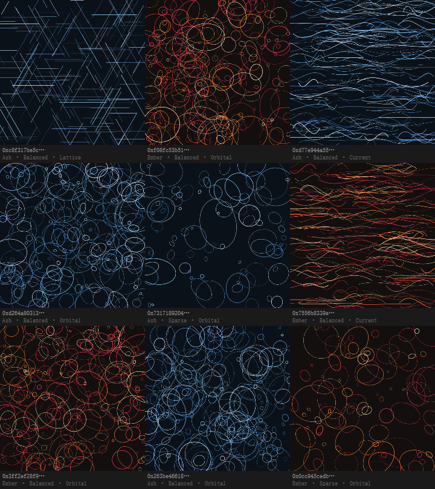

## 一张图理解它

```text
你的构想 / 现有 sketch / 目标平台
                 │
                 ▼
       SKILL.md：判断问题并路由
          ├─ 确定性、尺寸、特征、伦理
          ├─ Art Blocks 等平台资料
          └─ 工作流程与默认决策
                 │
                 ▼
          Claude 编写或修改作品
                 │
       ?hash / render / features / done
                 │
                 ▼
       Playwright 真实加载浏览器作品
          ├─ check：可复现性检查
          └─ render：单图 / 网格 / 普查 / 批量
```

## 已经实测的能力

| 实验 | 本地结果 | 它说明什么 |
| --- | --- | --- |
| 正常 fixture 重复运行 | 全部通过 | 同一 hash 重复像素一致，不同 hash 有差异，A-B-A 无全局污染，features 稳定 |
| 把两个确定性随机流替换为 `Math.random` | 4 项失败 | 工具能实际抓住未播种随机导致的像素和 metadata 漂移 |
| 单 seed 渲染 | 生成 800×800 PNG | `render --hash` 是真实导出器，不只是文档示例 |
| 9 seed 联系表 | 生成带 hash 和 features 的网格 | 可以从“只看一张好图”转向观察一个系列 |
| 500 seed census | 输出 Palette / Density 分布 | 可以测量实际出现的特征，而不是只相信代码中的权重 |
| 同一 seed 以 400 / 1600px 渲染 | 构图和 features 保持一致 | 上游 fixture 实现了其“同一作品、不同像素尺寸”的设计原则 |
| 参考链接检查 | 22 个 URL 全部可达 | 平台知识采用“稳定说明 + 运行时查最新官方文档”的维护方式 |
| Web 真实交互验收 | 全部通过 | 完整玩家事件、六角色视角、六产品、生成器/Skill/运行时原理剖面、品牌参数生产闭环、PNG/SVG/Manifest 下载、六场景、5000/10000 seed、双主题、键盘、三种视口、减弱动画和 Canvas fallback 都可工作 |
| Codex Skill validator / scan / check | 全部通过 | 项目内版本已经从“研究对象”变成可脚手架、可审计、可渲染的复用能力 |

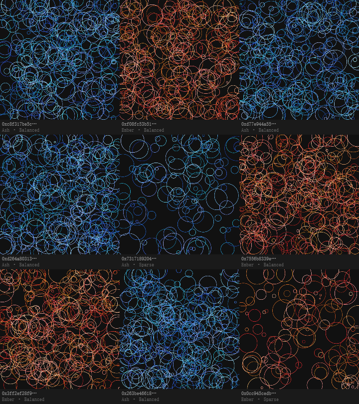

## 研究中发现的重要边界

- 上游 `v0.1.0` 脚本在本机 Windows 环境会触发 `ERR_HTTP_HEADERS_SENT`，尚未进入作品检查；原因和最小实验补丁见 [Windows 兼容性实验](experiments/windows-compatible/README.md)。
- 上游脚本证明的是固定 Chromium 环境中的同机复现，不证明不同 GPU 的 WebGL 像素完全一致。
- Art Blocks、Three.js、p5.js 等主要由知识资料覆盖，不是已经实现好的框架适配器或部署器。
- 源码中的非确定性 API 静态扫描目前是交给代理按清单检查，没有独立扫描程序。
- `census` 展示实测分布和启发式警告，但不会读取一份目标权重表并自动做统计拟合检验。
- 工具会执行 sketch 中的 JavaScript，也没有主动断网；研究未知项目时应按不可信代码处理。

## 运行与复现

环境：Windows、Node.js 22、Playwright 1.62.1、Chromium。

```powershell
npm install
npx playwright install chromium

# 生成故障对照 fixture
npm run prepare:broken

# 使用 Windows 兼容实验副本验证正常与故障项目
npm run check:good
npm run check:broken       # 预期退出码 1，并报告 4 项 FAIL

# 生成研究产物
npm run render:single
npm run render:grid
npm run census
npm run check:links

# 启动 Web、验证 Web 与项目内 Skill
npm run web
npm run test:web
npm run skill:validate
npm run skill:scan
npm run skill:check
npm run skill:grid

# 重现上游原版的 Windows 问题
npm run check:upstream
```

## 项目结构

```text
genart-skill-research/
├─ upstream/                         # 上游 v0.1.0 固定源码快照，不改动
├─ experiments/
│  ├─ make-broken-fixture.mjs        # 从正常 fixture 派生非确定性对照
│  └─ windows-compatible/            # 仅用于继续实验的最小兼容副本
├─ artifacts/                        # 单图、联系表、分辨率与批量导出证据
├─ docs/
│  ├─ 源码与实验研究报告.md
│  ├─ web-design-contract.md
│  └─ web-delivery.md
├─ web/                              # 可部署的交互式能力引导、完整事件、产品舞台与真实实验
│  ├─ case-core.js                   # 坏地图事件、命名子流、修复和 10000-seed 普查
│  ├─ lens-core.js                   # 六角色内容、证据与决策模型
│  ├─ lens-cinematic.js              # 六种发光确定性视觉现实渲染器
│  ├─ application-core.js             # 游戏/品牌/商品/数据/媒体/UI 产品 mockup 渲染器
│  └─ scenario-core.js                # 地图/装备/怪物/品牌/发行/QA 确定性渲染器
├─ skills/genart-studio/             # Codex 原生 Skill、参考资料、starter 和工具
├─ tests/web-smoke.mjs               # 真实 Chromium 跨状态 / 视口验收
├─ UPSTREAM.md
├─ package.json
└─ project.json
```

## 实验记录

| 日期 | 实验 / 变更 | 结果 | 判断 |
| --- | --- | --- | --- |
| 2026-08-30 | 固定上游 `3380ebc` 并完成源码结构拆解 | Skill、14 份参考资料、3 个运行脚本、fixture 与 CI 结构清晰 | 它是“知识 + 协议 + 工具”的组合，不是模型 |
| 2026-08-30 | 在 Windows 直接运行上游脚本 | `ERR_HTTP_HEADERS_SENT` | 上游 v0.1.0 存在 Windows 路径兼容问题 |
| 2026-08-30 | 使用最小兼容副本运行正常 / 故障 fixture | 正常全绿；`Math.random` 对照 4 项失败 | 核心确定性检查真实有效 |
| 2026-08-30 | 单图、网格、批量、500-seed census、尺寸对照 | 均成功生成 | 渲染与系列审查能力可执行 |
| 2026-08-30 | 检查参考资料 URL | 22/22 可达 | 当前资料入口没有确认失效链接 |
| 2026-08-30 | 构建 Genart Lab Web 引导并用真实鼠标/键盘验收 | 发现并修复 body 误绑定为模式按钮；全套 smoke 通过 | Web 不只展示结论，还能亲自制造和观测确定性故障 |
| 2026-08-30 | 移植 `genart-studio` Codex Skill | validator、scan、check、grid 全部通过 | 研究结果已经成为项目内可直接复用的生产能力 |
| 2026-08-30 | 增加六场景使用案例图谱 | 六个同-seed 独立渲染器、横向矩阵、键盘 tabs 与 fallback 全部通过 | 抽象机制已经映射到游戏、品牌、发行和工程质检 |
| 2026-08-30 | 增加玩家坏地图完整事件闭环 | 三次重放一致、route 修复后身份保留、10,000 seed 从 809 个封路降到 0 | 艺术输出已经被解释为可寻址、可诊断、可验证的产品状态 |
| 2026-08-30 | 增加同一事件的六角色视角 | 六个确定性证据图、输入/证据/决策链、键盘 tabs 与 fallback 全部通过 | 技术能力已经映射到客服、美术、工程、QA、制作和产品选型 |
| 2026-08-30 | 将多视角区从表格工作台重构为沉浸式 seed 舞台 | Canvas 扩展到全幅主视觉；六幅 cinematic 场景、前景 HUD、短转场和移动端方形舞台通过 | 用户先看到生成艺术的表现力，再按角色理解工程价值 |
| 2026-08-30 | 新增“从引擎到产品”六案例舞台 | 六个 1280×760 实时产品 mockup、同 seed 重放、换 seed、键盘、双主题、390px 与 fallback 全部通过 | 抽象生成能力已经转换成游戏、品牌、商品、数据、媒体和 UI 的可见交付物 |
| 2026-08-31 | 增加品牌生产闭环和三层原理剖面 | 五项业务参数、稳定/漂移对照、PNG/SVG/Manifest 下载、生成器/Skill/运行时说明通过浏览器回归 | 明确区分艺术算法、库的方法层与浏览器执行层，并形成暂时归档快照 |

## 归档与恢复条件

- [x] 将主 Skill 和脚本路径机制移植为 Codex 原生 Skill。
- [x] 固定上游提交、实验输入、Web 证据与浏览器验收结果。
- [x] 关联原库、GitHub Pages 演示、项目目录与归档总结。
- [ ] 当真实 Three.js / React Three Fiber 项目需要接入时，恢复并增加最小适配 fixture。
- [ ] 当团队需要跨浏览器发布门禁时，恢复并增加离线网络拦截、感知差异与多浏览器检查。
- [ ] 当 traits 成为真实发行规则时，恢复并给 census 增加置信区间、相关性和稀有组合预警。
