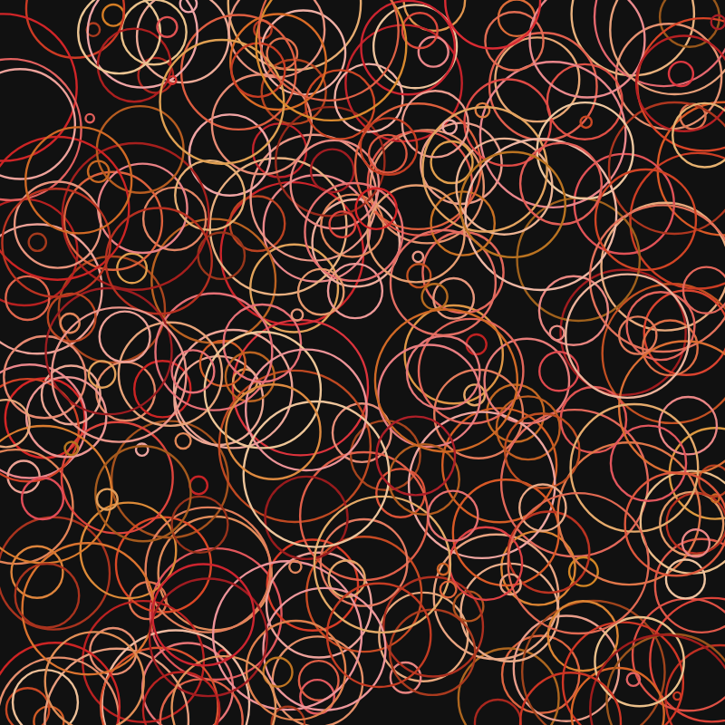

# genart-skill 源码与实验研究报告

## 1. 研究问题

本次研究回答五个问题：

1. 安装这个库以后，编码代理实际多了什么能力？
2. 哪些能力只是知识指导，哪些能力有程序可以直接执行？
3. 它依靠什么接口和算法完成确定性检查？
4. 上游宣称的单图、联系表、census 与批量导出是否能够真实运行？
5. 它目前有哪些能力边界、工程风险和可扩展方向？

成功标准不是复述 README，而是固定源码版本、运行正常与故障对照、查看生成图片、核对统计输出，并明确区分观察事实和推断。

## 2. 最准确的能力模型

它由三个部分组成：

| 部分 | 载体 | 作用 |
| --- | --- | --- |
| 领域知识 | `skills/genart/SKILL.md` 和 `references/` | 让 Claude 知道生成艺术中的默认做法、取舍、平台约束和伦理边界 |
| 作品协议 | URL 参数和四个浏览器全局约定 | 让任意 web sketch 可以被统一加载、重渲染、读取 features 和判断完成 |
| 可执行工具 | `check.mjs`、`render.mjs`、`check-links.mjs` | 用 Chromium 运行作品并产生检查结果、图片或统计数据 |

因此，最贴切的类比不是“画家”，而是“懂生成艺术的技术导演和质量控制台”。

## 3. 安装后到底发生什么

Claude Code 根据 Skill 描述中的生成艺术、seed、PRNG、traits、mint、SVG、plotter 等触发词加载主 Skill。主 Skill 不包含所有细节，而是按问题把代理路由到对应资料：

- `determinism.md`：hash、sfc32、命名随机子流、分布和确定性破坏源；
- `resolution.md`：归一化坐标、stroke/noise/density 和多尺寸输出；
- `features.md`：特征、权重、稀有度和批量测量；
- `tooling.md`：调试 UI、PNG/视频/SVG/plotter 输出；
- `verification.md`：检查协议、测试边界和固定运行环境；
- `ethics.md`：风格模仿、归属、许可证和 AI 披露；
- `platforms/`：各生成艺术平台的稳定心智模型与官方文档入口。

然后代理根据资料编写或修改用户项目。只有当项目满足最小协议并调用脚本时，才进入程序化验证阶段。Skill 本身不会自动生成图片，也不会自动部署到链上。

## 4. 最小作品协议

上游建议自托管 sketch 提供以下约定：

```text
输入
  ?hash=<64 hex>
  ?width=<number>
  ?height=<number>

输出 / 控制
  window.render(hash)      重新渲染同一页面
  window.$features         扁平的作品特征对象
  window.rendered          已完成的 Canvas
  genart:done              可选的完成事件
```

平台项目只需要加几行开发期 shim，就可以接入同一套检查脚本。这个协议是全库最值得复用的设计之一：它把具体平台 API 与工作室内部验证工具解耦。

## 5. 确定性原理

### 5.1 hash 到随机序列

`determinism.md` 将完整 32 字节 hash 混合为四个 32 位状态，再交给整数型 `sfc32` PRNG。相同 hash 得到相同随机序列；不同 hash 通常得到不同序列。

它避免在 PRNG 内使用 `sin` 等跨引擎可能有细微差异的浮点函数，并明确禁止用 `Math.random`、时钟和系统随机数决定作品内容。

### 5.2 命名随机子流

传统的单一随机流有一个版本稳定性问题：中间多调用一次 `rnd()`，后面的颜色、布局和 feature 都会整体漂移。上游用标签派生子流：

```js
stream(hash, "palette")
stream(hash, "layout")
stream(hash, "features")
```

这样布局代码的随机消费顺序变化，不会自动改变 palette 和 metadata。这不仅适用于上链艺术，也适用于程序化关卡、战利品、角色外观和可重现 bug。

### 5.3 像素检查

`check.mjs` 不截浏览器屏幕，而是直接读取 Canvas 原始 RGBA 数据并计算 SHA-256。测试包括：

1. 同一 hash 在新 context 中运行三次；
2. 两个不同 hash 的输出不能相同；
3. 同一页面执行 A、B、A，两个 A 必须相同；
4. 同一 hash 的 `$features` 必须稳定。

第三项用于发现模块缓存、未清空数组、累加器和对象池等跨渲染状态污染。

## 6. 实验结果

### 6.1 上游原版在 Windows 上的前置失败

命令：

```powershell
node upstream/scripts/check.mjs upstream/tests/fixture
```

结果：退出码 1，错误为 `ERR_HTTP_HEADERS_SENT`。同一问题影响 `check`、单图、网格和 census，因为它们共享 `scripts/lib.mjs`。

原因是服务器用 `path.join` 构造路径后只检查字符串是否以 `/` 结尾。Windows 返回 `\`，根目录没有追加 `index.html`；实现又在 `readFile` 之前发送 `200`，读取目录失败后尝试发送第二个 `404`。

为继续验证预期能力，本项目复制三个脚本到 `experiments/windows-compatible/`，只修正路径尾部分隔符和响应头发送时机。上游快照未修改。

### 6.2 正常 fixture

修正运行环境后，正常 fixture 的结果：

```text
repeatability
  ok  hash A → 06669011
  ok  hash B → 7e5f6b7f
distinctness
  ok  two different hashes produce two different renders
global state
  ok  A=06669011 B=7e5f6b7f A'=06669011
features
  ok  stable across 3 runs
```

观察事实：四类动态检查在上游提供的 Canvas fixture 上可工作。

### 6.3 故障对照

实验从正常 fixture 自动派生副本，只把 `features` 和 `layout` 使用的确定性 `stream(...)` 替换为 `Math.random`。

结果：

```text
repeatability    2 项 FAIL
distinctness     ok
global state     FAIL
features         FAIL
合计             4 failure(s)
```

这证明检查器不是“永远输出绿色”的展示脚本，也说明 distinctness 单独通过不能证明确定性；多个互补测试是必要的。

### 6.4 单图与联系表

单 seed 导出得到 `Palette=Ember`、`Density=Balanced` 的 800×800 PNG。九宫格输出同时显示图像、hash 和 features，能够直观看到同一算法生成的颜色、密度和布局变化。




### 6.5 500-seed feature census

fixture 声明的目标权重与本次实测如下：

| Trait | 值 | 目标权重 | 500 seed 实测 |
| --- | --- | ---: | ---: |
| Palette | Ember | 45% | 44.4% |
| Palette | Ash | 30% | 33.6% |
| Palette | Verdant | 18% | 15.0% |
| Palette | Aurora | 7% | 7.0% |
| Density | Sparse | 25% | 24.2% |
| Density | Balanced | 55% | 54.6% |
| Density | Dense | 20% | 21.2% |

观察事实：工具成功收集 500 个 seed 的 features，并估算其在 256 件 edition 中的数量。

边界：工具不知道源码中的目标表，上表的“目标 vs 实测”是本研究人工整理；上游 `census` 本身只输出实测值、重复 tuple 和启发式警告。

### 6.6 分辨率与批量导出

同一 hash 分别以 400px 和 1600px 输出，features 都是 `Ember / Balanced`。人工查看确认圆的位置、数量和整体构图一致，线宽随尺寸缩放。该观察验证的是 fixture 的视觉稳定性，不是通用自动证明。

批量模式成功输出 3 张 1000px、以 hash 片段命名的独立 PNG。

### 6.7 资料链接

`check-links.mjs` 扫描 16 个文件中的 22 个唯一 URL，本次运行全部返回可接受状态，没有确认的失效链接。

## 7. 知识能力与程序能力的边界

| README 中的说法 | 实际落点 | 判断 |
| --- | --- | --- |
| 支持 Canvas、p5、Three.js、WebGL、SVG | Skill 资料和通用 Canvas 协议 | 有指导能力，但没有每个框架的现成适配器 |
| 支持多个上链平台 | 8 份平台资料页 | 是平台决策和查文档指南，不是一键部署工具 |
| 检查确定性 | `check.mjs` | 有真实运行能力，但范围是同机 Chromium |
| 设计 features 和 rarity | 资料 + census | 能指导并测量，尚无目标分布统计检验 |
| PNG / 视频 / plotter | PNG 有运行脚本；视频和 SVG 主要是代码模式说明 | 能力成熟度不同，不能视为全部一键完成 |
| 伦理与许可证 | 规范性资料 | 是代理行为约束，不是自动法律审查器 |

## 8. 当前局限与风险

### 已实证

- `v0.1.0` 在 Windows 上存在共享服务器路径 bug。
- 动态工具需要用户项目安装 Playwright；插件本身虽然零依赖，整个工作流并非零依赖。
- fixture 是 CI 合约样例，上游明确说它不是 starter template。

### 源码分析得到

- `check.mjs` 只对默认的两个 hash 做有限抽样，不能证明 seed 空间不存在其他碰撞或异常。
- feature 稳定性检查只取第一个 hash 的多次结果。
- `census` 没有输入目标权重表，不能自动回答偏差是否统计显著。
- 静态危险 API 搜索是文档清单，没有机器执行的 scanner。
- 工具只启动 Chromium；Firefox、WebKit 和移动设备检查仍靠人工扩展。
- 脚本运行项目 JavaScript，浏览器 context 没有主动屏蔽外部网络。未知 sketch 可能包含恶意或隐私泄露代码，应放进隔离环境。
- “无网络依赖”是建议，但当前检查工具没有把断网作为可验证条件。

### 原理上无法承诺

- 不同 GPU 上的 WebGL/WebGPU 逐像素一致；
- 不同 JS 引擎中所有浮点超越函数完全一致；
- 十年后的浏览器仍可执行作品；
- 稀有度设计、审美质量或原创性一定优秀。

## 9. 适用场景

高价值：

- long-form 上链生成艺术；
- 一个算法批量生成整套海报、封面或收藏品；
- 需要 seed 重放和 metadata 稳定的 web sketch；
- mint 前的系列 QA、联系表和特征普查；
- 程序化关卡、地图、角色外观、战利品和每日挑战中的随机流隔离；
- 建设自己的领域 Skill，希望参考“主路由 + 按需资料 + 可执行脚本 + fixture + CI”架构。

低价值：

- 只想通过文本直接生成一张位图；
- 不需要重放或批量版本的一次性网页动画；
- 原生 Unity、Unreal、Blender 工作流且不准备做 web 适配；
- 希望插件替代艺术方向、审美判断或平台申请流程。

## 10. 最值得扩展的方向

1. **Codex 原生化**：转换 Skill 元数据和脚本根路径，并接入本地图片查看闭环。
2. **框架适配器**：为 Canvas、p5、Three.js、R3F、SVG、WebGL 分别提供最小可运行 fixture。
3. **跨平台测试**：修复 Windows，增加 Firefox/WebKit、移动 viewport 和 SwiftShader 模式。
4. **安全执行**：默认拦截外部网络、限制本地文件服务范围，并建议在沙箱运行未知 sketch。
5. **静态扫描**：扫描源码和生产 bundle 中的时钟、随机、网络、系统字体和不稳定遍历。
6. **统计增强**：输入目标权重表，增加置信区间、卡方检验、条件特征、相关性和组合熵。
7. **视觉回归**：维护 golden seeds，使用感知差异而非跨 GPU 的严格像素相等。
8. **生产检查**：bundle 体积、依赖许可证、离线资源、平台 done signal 和 metadata schema 预检。

## 11. 对当前研究仓库的意义

这个库最值得借鉴的未必是某段 PRNG 代码，而是它展示了一种高质量领域 Skill 的结构：

```text
提示词负责判断
参考资料负责知识
最小协议负责解耦
脚本负责证据
fixture 负责定义合约
CI 负责防止能力退化
```

如果后续把它移植到 Codex，应该保留这套分层，同时补齐 Windows、隔离执行、Three.js fixture 和统计检验。这样得到的不是“另一个提示词包”，而是可重复使用的生成艺术研究与生产基础设施。
