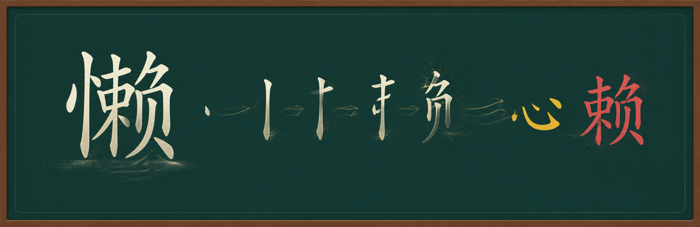
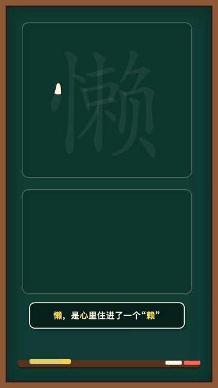
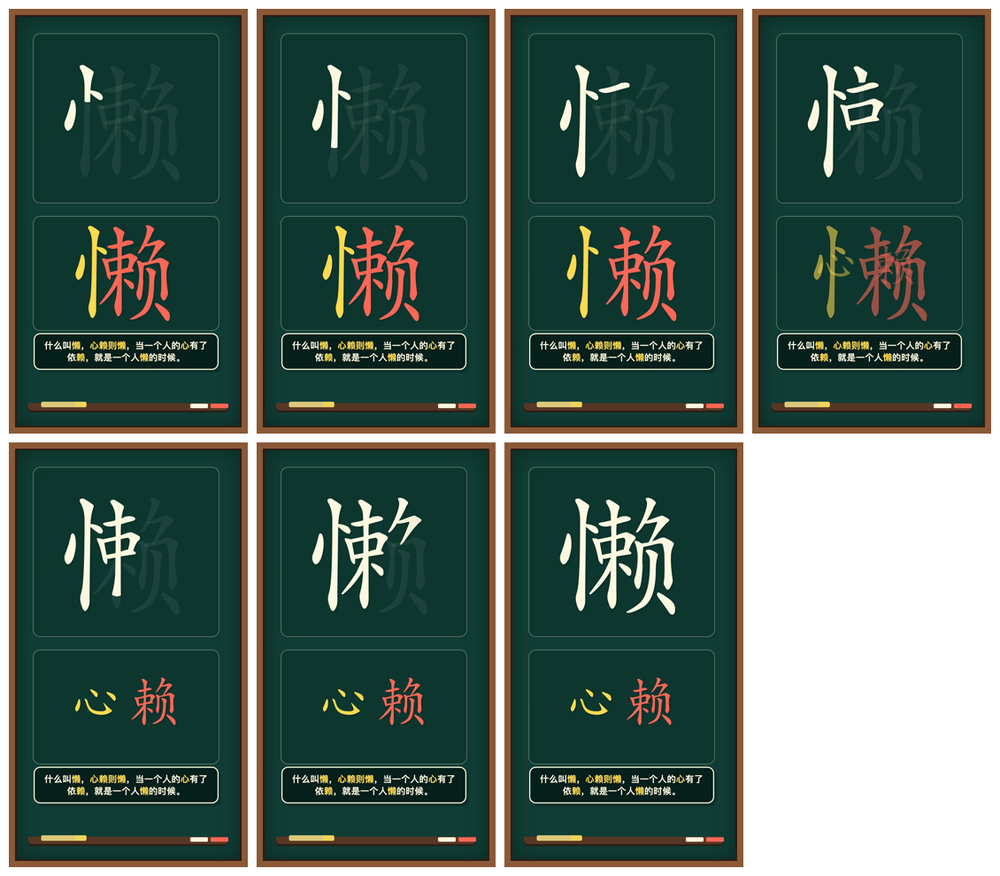
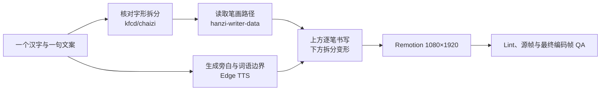

<p align="center">
  
</p>

<p align="center">
  <a href="https://github.com/Mr-funny/hbg-hanzi-chaizi-video/actions/workflows/ci.yml"></a>
  
  
  
  
  
</p>

<p align="center">
  <strong>把一个汉字写出来、拆开来，再讲成一句能被记住的话。</strong><br />
  上方按真实笔画路径逐笔书写，下方将偏旁部件分离并演变为独立汉字，<br />
  配合 Edge TTS、单行同步字幕、固定音量 BGM 和可复现的 Remotion 渲染流程。
</p>

## ✨ 最终效果

<p align="center">
  
</p>

当前示例以“懒”为主题：

> 懒，是心里住进了一个“赖”。凡事都想等一等、靠一靠，时间久了，行动也就慢了下来。

| 上半区 | 下半区 | 声音与字幕 |
|---|---|---|
| 从第一笔开始写“懒”，最后一笔与旁白结尾同步 | 完整字先拆为“忄 + 赖”，再将“忄”演变成“心” | 云健男声保持原音调，以 80% 语速生成；字幕每次只显示一行 |

<details>
  <summary>展开查看七个关键阶段</summary>
  <p align="center">
    
  </p>
</details>

> [!IMPORTANT]
> “心 + 赖”属于趣味拆字和视觉联想，不是《说文解字》或严格的历史字源结论。结构拆分不自动等于造字本义。

## 🎯 它解决什么问题

| 常见问题 | 项目的处理方式 |
|---|---|
| 普通字体只能显示完整汉字，不能逐笔写 | 使用 `hanzi-writer-data` 的笔画轮廓与中线数据，按路径长度分配书写时间 |
| 上下两块都逐笔动画，画面显得混乱 | 只让上方逐笔书写；下方使用完整部件分离、变形并定格 |
| 笔画先写完，旁白仍在继续 | 视频时长由真实 TTS 音频决定，最后一笔覆盖完整旁白时间轴 |
| 字幕一次出现太多 | 根据 Edge TTS 词语边界逐行切换，始终保持单行显示 |
| 字幕行末标点影响画面节奏 | 旁白保留标点控制停顿，画面字幕单独移除行末标点 |
| 慢放音频导致音色变沉 | 直接以 `rate=-20%` 生成较慢旁白，不在播放器中二次降速 |
| 拆字文案容易机械套模板 | 字形结构只作为入口，文案允许自然联想，但明确区分趣味表达与历史字源 |
| BGM 忽大忽小 | BGM 固定为 `volume=0.8`，不做 voiceover ducking 或动态音量曲线 |

## 🧭 工作流



数据职责保持分离：

- [Make Me a Hanzi](https://github.com/skishore/makemeahanzi) / [`hanzi-writer-data`](https://github.com/chanind/hanzi-writer-data)：提供笔画轮廓、中线和书写顺序。
- [`kfcd/chaizi`](https://github.com/kfcd/chaizi)：用于核对可见字形结构；本仓库没有把结构拆分冒充字源结论。
- [Remotion](https://www.remotion.dev/)：负责确定性的动画、音频、字幕与视频渲染。
- [Edge TTS](https://github.com/rany2/edge-tts)：生成中文旁白及词语时间边界。

## 🚀 快速开始

环境要求：Node.js、Python 3、FFmpeg / ffprobe。

```bash
git clone https://github.com/Mr-funny/hbg-hanzi-chaizi-video.git
cd hbg-hanzi-chaizi-video

npm install
python3 -m pip install -r requirements.txt
npm run tts
```

将一首你拥有合法使用权的背景音乐放到：

```text
public/audio-lan-yunjian/background.mp3
```

启动 Remotion Studio：

```bash
npm run dev
```

渲染 H.264 成片：

```bash
npm run render
```

默认输出：

```text
renders/lan-chaizi.mp4
```

## 🛠️ 如何换成另一个汉字

1. 在 `scripts/generate_lan_yunjian_edge_tts.py` 中修改旁白 `TEXT` 和单行字幕 `CAPTION_LINES`。
2. 在 `src/LanYunjianTransformComposition.tsx` 中更换目标字及独立部件的 `hanzi-writer-data` JSON。
3. 根据真实结构重新标注每一笔属于哪个部件，不能沿用“懒”的前三笔分组规则。
4. 调整下方部件的位移、缩放和最终排版，使变形完成后的独立字仍然清晰可读。
5. 重新运行 `npm run tts`、`npm run lint` 和 `npm run render`，检查首笔、拆分中点、变形完成、最后一笔及最终编码帧。

核心时间规则：

```text
上方：第一帧附近开始写 → 最后一笔与旁白末尾同步
下方：完整字出现 → 部件分离 → 独立字变形 → 定格到结束
字幕：读到哪一行，画面才显示哪一行
```

## 📁 项目结构

```text
hbg-hanzi-chaizi-video/
├── docs/
│   ├── article.md                         # 项目长文与设计复盘
│   └── imgs/                              # README 与文章演示图
├── public/audio-lan-yunjian/              # 本地生成旁白与自备 BGM
├── scripts/
│   └── generate_lan_yunjian_edge_tts.py   # TTS、词语边界与字幕时间轴
├── src/
│   ├── CaptionBand.tsx                    # 单行同步字幕
│   ├── LanYunjianTransformComposition.tsx # 笔画、拆分、变形和音频合成
│   ├── Root.tsx
│   └── index.ts
├── package.json
└── remotion.config.ts
```

## ✅ 当前示例参数

| 项目 | 设置 |
|---|---|
| 画布 | 1080×1920，9:16 |
| 帧率 | 30 fps |
| 旁白 | `zh-CN-YunjianNeural` |
| 语速 | `rate=-20%` |
| 音调 | 默认，不修改 |
| 字幕 | 单行、跟随词语边界、移除行末标点 |
| BGM | `volume=0.8`，固定音量 |
| 示例时长 | 约 10.5 秒 |
| 示例帧数 | 314 帧 |

## 🎵 音乐与生成文件

本仓库不提交以下文件：

- 用户自行提供的背景音乐；
- Edge TTS 生成的 MP3、WAV 和词语边界文件；
- 本地渲染的 MP4；
- `node_modules` 和 QA 中间文件。

示例成片所用 BGM 的再次分发授权尚未在本项目中确认，因此没有随源码公开。请自行提供合法授权的 `background.mp3`。

## 📖 进一步阅读

- [长文：我把“拆一个汉字”，做成了一个开源视频生成项目](docs/article.md)
- [“忙”字逐笔书写与拆分联系表](docs/imgs/01-contact-mang-writing-splitting.png)
- [“懒”字最终定格画面](docs/imgs/03-final-lan-heart-rely.png)

## License

项目代码使用 [MIT License](LICENSE)。Remotion、Edge TTS、`hanzi-writer-data`、Make Me a Hanzi 及其他第三方数据遵循各自许可证。
