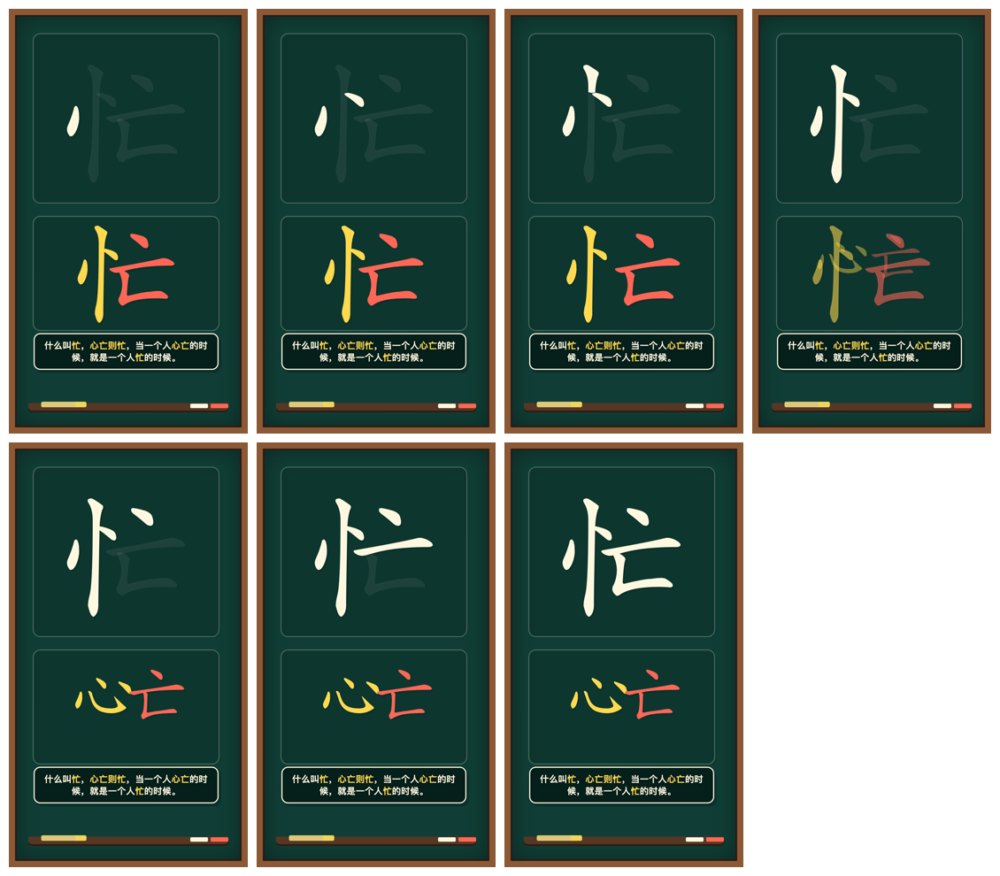
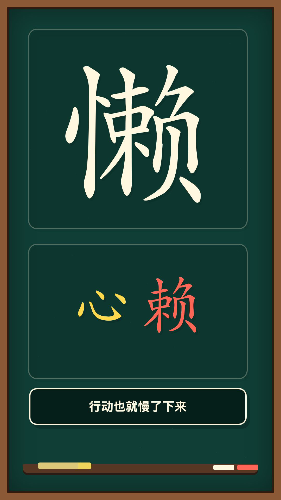

# 我把“拆一个汉字”，做成了一个开源视频生成项目

这个项目最初来自一个很简单的想法：

有没有什么开源项目，可以输入一个汉字，然后一笔一画地把它写出来？

如果不只是展示笔顺，还能把汉字拆开，让偏旁和部件分别运动，再配上一句有意思的解释，是不是就可以做成一种新的汉字短视频？

比如“忙”。

上半部分，一笔一画写出完整的“忙”字；下半部分，“忄”和“亡”从字中分离，“忄”再演变成完整的“心”字。

配合旁白：

> 什么叫忙，心亡则忙，当一个人心亡的时候，就是一个人忙的时候。

这就是整个项目最早的雏形。

## 第一步，是找到能够真正“写字”的数据

普通字体只能显示一个完整汉字，却不知道第一笔在哪里、每一笔如何运动。

为了实现逐笔书写，我研究了多个 GitHub 项目，最后主要使用了两类数据。

第一类是 [Make Me a Hanzi](https://github.com/skishore/makemeahanzi) 及其相关的 `hanzi-writer-data`。

它提供了汉字每一笔的轮廓和中线数据。利用这些路径，可以计算笔画顺序、长度和出现时间，让汉字从第一笔开始，逐渐写到最后一笔。

第二类是 [kfcd/chaizi](https://github.com/kfcd/chaizi)。

它的作用不是提供笔顺，而是告诉程序一个汉字在结构上可以拆成哪些部件。比如“懒”可以拆出“忄”和“赖”，“忙”可以拆成“忄”和“亡”。

这两个项目解决的是不同问题：

- Make Me a Hanzi 负责“这个字怎样一笔一画写出来”
- kfcd/chaizi 负责“这个字从字形上可以怎样拆开”

有了这两部分数据，视频才不仅能显示一个汉字，还能真正表现它从书写到拆分的过程。

## 上面写字，下面拆字

最终的视频采用 9:16 竖屏结构。

画面上半部分负责书写完整汉字。从第一帧附近开始落笔，每一笔根据路径长度依次出现。最后一笔写完时，旁白也刚好结束，视频随即停止，不额外拖长。

下半部分则负责拆字动画。

它不会再次逐笔写偏旁，而是先显示完整汉字，然后让不同部件从原来的位置分离，再演变成适合表达文案的独立汉字。

以“懒”为例：

“忄”从左侧分离后，逐渐变成完整的“心”；右侧的“赖”移动到另一边，最终形成“心”和“赖”并列的画面。

对应的文案是：

> 懒，是心里住进了一个“赖”。凡事都想等一等、靠一靠，时间久了，行动也就慢了下来。

下方动画完成以后不再重复运动，而是停留到视频结束。这样观众可以继续阅读字幕，同时看清拆字后的结果。

## 最难的部分不是动画，而是文案

刚开始写拆字文案时，很容易陷入固定模板：

“什么叫某字，某某则某字……”

偶尔使用会有效果，但每个汉字都这样解释，很快就会显得机械。

后来尝试拆“懒”时，我写过一句：

> 懒，是心里住进了一个“赖”。凡事都想等一等、靠一靠，时间久了，行动也就慢了下来。

它比生硬地解释“忄代表心、赖代表依赖”自然得多。

从那以后，这个项目对文案有了一个更明确的方向：拆字只是入口，真正要表达的是一种生活感受。

字形负责制造记忆点，文案负责完成情绪上的升华。

但这里也必须划清界限。

这种内容属于“趣味拆字”和视觉联想，不等同于《说文解字》，也不能冒充严谨的汉字历史来源。`kfcd/chaizi` 只能证明字形可以这样拆分，并不能自动证明文案就是这个字的真实字源。

因此，项目中的文案允许联想，但不会把联想包装成古文字结论。

## 让声音决定视频的时间

旁白采用 Edge TTS 的中文男声音色 `zh-CN-YunjianNeural`。

语速设置为 `-20%`，也就是原始语速的 80%，不额外降低音调。

这里没有使用播放器把音频强行放慢，因为那样容易让声音变沉、变闷。项目直接生成较慢的 TTS 音频，尽量保留云健原本的音色。

生成旁白时，还会同时读取词语边界和真实音频时长。视频总时长、字幕切换和笔画进度，都以这条真实音轨为准。

这样可以保证：

- 旁白说到哪里，字幕就显示到哪里
- 每次只显示一行字幕
- 上方笔画持续写到旁白结束
- 最后一笔完成后，视频立即结束

字幕显示和 TTS 文本也被分开处理。

旁白原文保留逗号和句号，用于控制自然停顿；画面字幕则删除每一行末尾的标点，避免一句话已经形成天然停顿后，画面上还多出一个没有必要的句号。

例如旁白原文可以是：

> 时间久了，行动也就慢了下来。

画面字幕则分别显示：

> 时间久了

> 行动也就慢了下来

## 从“忙”到“懒”，逐渐形成固定工作流

这个项目不是一次设计完成的。

早期版本的笔画速度太快，旁白还没说完，字已经写完；下方的偏旁也被设计成逐笔书写，导致上下两个区域同时运动，视觉重点非常混乱。

后来逐步调整成：

- 上方完整汉字逐笔书写
- 下方只做完整部件的分离和变形
- 拆分完成后保持静止
- 字幕一次只显示一行
- 文案避免机械模板
- 旁白、字幕和最后一笔使用同一条时间轴
- BGM 保持固定音量，不随旁白动态忽大忽小
- 视频结束时间由旁白决定

画面风格也从普通电脑字体，逐渐改成更接近粉笔、毛笔墨迹和轻微飞白的质感。但无论使用什么效果，最重要的前提始终是笔画轮廓必须清楚，不能为了追求墨水晕染而影响汉字辨认。

这些规则后来被整理成了一个可复用的汉字拆字视频工作流。

以后更换汉字时，只需要重新确定：

- 目标汉字的笔画数据
- 在哪一笔处分隔不同部件
- 偏旁应该演变成哪个完整汉字
- 对应的趣味拆字文案
- 字幕的语义分行

视频尺寸、旁白音色、书写节奏、字幕规则、背景音乐和质量检查都可以继续复用。

## 项目已经开源

目前，“懒”字视频的 Remotion 项目已经开源到 GitHub：

[hbg-hanzi-chaizi-video](https://github.com/Mr-funny/hbg-hanzi-chaizi-video)

仓库中包含：

- Remotion 动画源码
- 汉字逐笔书写逻辑
- “忄”变成“心”的拆分动画
- Edge TTS 旁白生成脚本
- 单行同步字幕
- 1080×1920 竖屏视频配置
- 完整的安装和渲染说明

示例视频使用的背景音乐没有直接提交到仓库，因为暂时没有确认它是否允许作为独立文件再次分发。使用者可以自行准备一首拥有合法使用权的音乐，按照 README 中的路径放入项目。

## 这不仅是在“解释一个字”

这个项目真正想做的，并不是把汉字变成一套固定答案。

它更像是在汉字的结构和人的生活经验之间，搭建一座小小的桥。

“忙”可以让人想到心的缺席。

“懒”可以让人想到心里那个总想依赖和拖延的自己。

这些解释未必是古代造字者原本的意思，却可能成为现代人重新记住一个汉字的方式。

上面，一笔一画写出这个字。

下面，一层一层拆开这个字。

最后留下的，不只是偏旁和部件，也是一句值得停下来想一想的话。
