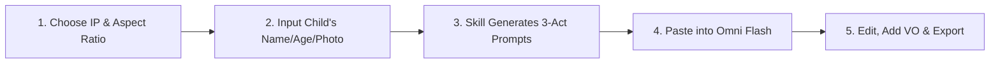

<div align="center">

[简体中文](README.md) · [**English**](README.en.md) · [日本語](README.ja.md) · [한국어](README.ko.md) · [Español](README.es.md)

# 🎂 Kid Papercraft

### Turn any child's birthday into a magical 30-second stop-motion origami video with popular animation heroes.

A production-ready AI Skill that transforms a child's name, age, and photo into a 3-act origami stop-motion short film using **Gemini Omni Flash**.


<br/>


<br/>

Built for personalized birthday greetings, TikTok / Reels / WeChat Video channels, family celebrations, and keepsake animations.

</div>

---

## ✨ Features

- 🎭 **5 Iconic Cartoon Worlds**: SpongeBob, Peppa Pig, Ultraman, Paw Patrol, and Doraemon in tactile papercraft aesthetics.
- ⏱️ **3-Act Story Arc (30 Seconds = 3 × 10s)**:
  - **Act 1 (0–10s) — Creative Entrance**: IP characters burst out of folding paper scenes with playful choreography.
  - **Act 2 (10–20s) — Birthday Celebration**: Characters hold a glowing birthday cake and banner with the child's custom origami avatar.
  - **Act 3 (20–30s) — Heartwarming Habits**: Cute micro-animations reminding kids to brush teeth 🪥, sleep on time 😴, and eat healthy 🍽️.
- 👶 **Personalized Child Avatar**: Seamlessly integrates the child's appearance description and supports Reference Image inputs.
- 📐 **Dual Aspect Ratios**: Fully composed for `9:16` (Vertical for Shorts/Reels/Douyin) and `16:9` (Horizontal for TV/Tablets).
- 🎙️ **Voiceover & Subtitle Scripts**: Tailored dialogue scripts matching each character's voice style for post-production assembly.

---

## 🎬 Supported Animation IPs

| # | IP | Lead Characters | Origami Scene Theme |
|:---:|:---|:---|:---|
| 🧽 | **SpongeBob SquarePants** | SpongeBob & Patrick Star | Origami Bikini Bottom Pineapple House & coral reef |
| 🐷 | **Peppa Pig** | Peppa & George | Origami muddy paper puddles & grassy hills |
| ⭐ | **Ultraman** | Chibi Heroic Giant & friendly kaiju | Miniature folding paper skyline at sunset |
| 🐶 | **Paw Patrol** | Chase & Marshall | Mini origami rescue town square & folding kennel |
| 🤖 | **Doraemon** | Doraemon & Nobita | Cozy origami bedroom with magical paper gadgets |

---

## 📋 Example Generated Prompts (SpongeBob 5th Birthday)

<div align="center">
  <a href="assets/readme/spongebob-birthday-demo.mp4">
    
  </a>
  <p><em>🎬 SpongeBob Theme · Lele's 5th Birthday Stop-Motion Demo (<strong>Click GIF for full HD video with audio</strong>)</em></p>
</div>

### 🎬 Clip 1: Creative Entrance (0–10s)
```text
Charming stop-motion animation of an origami ocean world. Beautifully textured colored paper cutouts of SpongeBob SquarePants and Patrick Star made of origami, popping out of a folding paper pineapple house and a paper rock, doing a silly dance and bumping into each other, laughing joyfully. Paper bubbles float up around them. Warm organic lighting, tactile paper textures, gentle camera pan, soft pastel color palette, whimsical and cozy atmosphere.
```

### 🎬 Clip 2: Birthday Celebration (10–20s)
```text
Charming stop-motion animation in a colorful origami underwater party room with paper coral and seaweed decorations. Beautifully textured colored paper cutouts of origami SpongeBob SquarePants and Patrick Star wearing paper party hats and blowing paper horns standing together with a cute small origami paper child (a cheerful boy with a round face, short black hair, black-rimmed glasses, and a cozy yellow hoodie), all gathered around a large origami birthday cake with 5 paper candles glowing softly. The characters hold up a folding paper banner that reads "Happy Birthday Lele!". Paper confetti and tiny origami stars fall gently from above. Warm organic lighting, tactile paper textures, gentle camera pan, soft pastel color palette, whimsical and cozy atmosphere.
```

### 🎬 Clip 3: Heartwarming Habits (20–30s)
```text
Charming stop-motion animation montage in SpongeBob's origami pineapple house interior. Beautifully textured colored paper cutouts showing three quick adorable scenes: First, the cheerful origami SpongeBob cheerfully brushing teeth with a tiny origami toothbrush, with sparkles of paper glitter around the smile. Then, the cheerful origami SpongeBob yawning cutely and tucking into a cozy origami paper bed with a paper star nightlight. Finally, the cheerful origami SpongeBob happily eating from a colorful origami paper plate with tiny paper vegetables and rice. Each scene transitions with a gentle paper fold wipe. Warm organic lighting, tactile paper textures, gentle camera pan, soft pastel color palette, whimsical and cozy atmosphere.
```

---

## 🛠️ Workflow



1. **Activate Skill**: Pick aspect ratio (`9:16` or `16:9`) and choose an animation IP.
2. **Personalize**: Enter child's name, age, physical traits (or upload a portrait photo).
3. **Get Prompts**: Skill generates 3 locked Omni Flash prompts with character voiceover lines.
4. **Generate Video**: Paste prompts into **Gemini Omni Flash** to generate three 10s clips.
5. **Assemble**: Import to CapCut/Premiere, sequence into a 30s film, add VO and sound effects.

---

## 📦 Installation & Setup

### For Antigravity / Gemini CLI / Codex:

Clone this repository:

```bash
git clone https://github.com/kaomei/kid-papercraft.git
cd kid-papercraft
```

Copy the skill to your skills directory:

```bash
# Antigravity / Gemini CLI
cp -R skills/kid-papercraft ~/.gemini/config/skills/kid_papercraft

# Codex CLI
cp -R skills/kid-papercraft "${CODEX_HOME:-$HOME/.codex}/skills/kid_papercraft"
```

Invoke in conversation:

```text
Help me make a papercraft birthday greeting video!
```

---

## ⚠️ Disclaimer & IP Notice

1. **Non-Affiliation**: This open-source repository (`kid-papercraft`) provides AI prompt engineering templates and workflow skills. It is **independent and not affiliated with, sponsored by, or endorsed by any animation studios or trademark owners**.
2. **Intellectual Property Rights**: All animated characters, names, and visual likenesses (including but not limited to SpongeBob SquarePants, Peppa Pig, Ultraman, Paw Patrol, and Doraemon) are the property and trademarks of their respective copyright holders.
3. **Permitted Use**: The prompt templates provided are intended solely for personal study, academic research, AI generative art exploration, and **non-commercial family birthday greetings**. Users are responsible for complying with applicable local copyright laws and platform terms of service.

---

## 🤝 Contributing

Pull requests, new cartoon IP templates, and prompt optimizations are welcome! Feel free to open an issue.

If this project helps you create unforgettable memories for children, please **give it a Star ⭐️ to support kaomei**!

## 📄 License

[MIT License](LICENSE) © 2026 [kaomei](https://github.com/kaomei)
