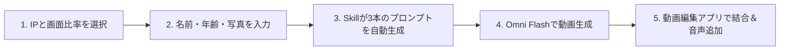

<div align="center">

[简体中文](README.md) · [English](README.en.md) · [**日本語**](README.ja.md) · [한국어](README.ko.md) · [Español](README.es.md)

# 🎂 Kid Papercraft (子ども向け折り紙風コマ撮り誕生日動画生成器)

### 大人気アニメヒーローと一緒に、温もりと魔法に満ちた30秒の折り紙コマ撮り誕生日ムービーを作成。

クリエイターと保護者のためのオープンソース AI Skill。子どもの名前、年齢、写真、または外見の特徴を入力するだけで、**Gemini Omni Flash** モデルに対応した3部構成のコマ撮りアニメーションプロンプトと日本語/中国語対応のボイスオーバー台本を生成します。


<br/>


<br/>

適用シーン：**子どもの誕生日サプライズ、家族のお祝い、TikTok / YouTube Shorts / Instagram リール用ショート動画**。

</div>

---

## ✨ 主な特徴

- 🎭 **5大人気アニメの世界観を折り紙化**：スポンジ・ボブ、ペッパピッグ、ウルトラマン、パウ・パトロール、ドラえもんの手作りペーパークラフト質感。
- ⏱️ **30秒の黄金3幕構成（10秒 × 3クリップ）**：
  - **第1幕（0–10秒）ユニークな登場**：キャラクターたちが飛び出す絵本のように楽しく登場。
  - **第2幕（10–20秒）バースデーセレブレーション**：キャンドルが灯るケーキとバナーを囲み、お子さまの折り紙キャラクターと一緒に祝福。
  - **第3幕（20–30秒）心温まる生活習慣メッセージ**：歯磨き 🪥、おやすみ 😴、ご飯をもぐもぐ 🍽️ の可愛いショートアニメ。
- 👶 **オリジナル折り纸アバター**：お子さまの特徴を反映し、Reference Image（参考画像）のアップロードにも対応。
- 📐 **マルチアスペクト比**：`9:16`（縦型ショート動画）と `16:9`（横型テレビ・タブレット）に対応。
- 🎙️ **キャラクター音声・字幕台本付属**：各キャラクターの個性に合わせたセリフ付き。

---

## 🎬 対応する5大アニメIP

| # | アニメ IP | メインキャラクター | 折り紙シーンテーマ |
|:---:|:---|:---|:---|
| 🧽 | **スポンジ・ボブ** | スポンジ・ボブ & パトリック | 折り紙のパイナップルの家とサンゴ礁 |
| 🐷 | **ペッパピッグ** | ペッパ & ジョージ | 折り紙の芝生の丘と泥たまり |
| ⭐ | **ウルトラマン** | Q版ヒーロー & なかよし怪獣 | 夕焼けのミニチュア折り紙都市 |
| 🐶 | **パウ・パトロール** | チェイス & マーシャル | ミニ折り紙レスキュータウンと犬小屋 |
| 🤖 | **ドラえもん** | ドラえもん & のび太 | ひみつ道具がいっぱいの折り紙の子ども部屋 |

---

## 📋 プロンプト生成サンプル（スポンジ・ボブ 5歳の誕生日）

<div align="center">
  <a href="assets/readme/spongebob-birthday-demo.mp4">
    
  </a>
  <p><em>🎬 スポンジ・ボブ テーマ · 30秒折り紙コマ撮り誕生日動画デモ（<strong>GIFをクリックするとフルHD音声付き動画を再生できます</strong>）</em></p>
</div>

### 🎬 Clip 1: 登場シーン (0–10s)
```text
Charming stop-motion animation of an origami ocean world. Beautifully textured colored paper cutouts of SpongeBob SquarePants and Patrick Star made of origami, popping out of a folding paper pineapple house and a paper rock, doing a silly dance and bumping into each other, laughing joyfully. Paper bubbles float up around them. Warm organic lighting, tactile paper textures, gentle camera pan, soft pastel color palette, whimsical and cozy atmosphere.
```

### 🎬 Clip 2: バースデーセレブレーション (10–20s)
```text
Charming stop-motion animation in a colorful origami underwater party room with paper coral and seaweed decorations. Beautifully textured colored paper cutouts of origami SpongeBob SquarePants and Patrick Star wearing paper party hats and blowing paper horns standing together with a cute small origami paper child (a cheerful boy with a round face, short black hair, black-rimmed glasses, and a cozy yellow hoodie), all gathered around a large origami birthday cake with 5 paper candles glowing softly. The characters hold up a folding paper banner that reads "Happy Birthday Lele!". Paper confetti and tiny origami stars fall gently from above. Warm organic lighting, tactile paper textures, gentle camera pan, soft pastel color palette, whimsical and cozy atmosphere.
```

### 🎬 Clip 3: 生活習慣メッセージ (20–30s)
```text
Charming stop-motion animation montage in SpongeBob's origami pineapple house interior. Beautifully textured colored paper cutouts showing three quick adorable scenes: First, the cheerful origami SpongeBob cheerfully brushing teeth with a tiny origami toothbrush, with sparkles of paper glitter around the smile. Then, the cheerful origami SpongeBob yawning cutely and tucking into a cozy origami paper bed with a paper star nightlight. Finally, the cheerful origami SpongeBob happily eating from a colorful origami paper plate with tiny paper vegetables and rice. Each scene transitions with a gentle paper fold wipe. Warm organic lighting, tactile paper textures, gentle camera pan, soft pastel color palette, whimsical and cozy atmosphere.
```

---

## 🛠️ 制作ワークフロー (Workflow)



---

## 📦 インストール方法

```bash
git clone https://github.com/kaomei/kid-papercraft.git
cd kid-papercraft

# Antigravity / Gemini CLI の場合
cp -R skills/kid-papercraft ~/.gemini/config/skills/kid_papercraft

# Codex CLI の場合
cp -R skills/kid-papercraft "${CODEX_HOME:-$HOME/.codex}/skills/kid_papercraft"
```

チャットで呼び出し：
```text
子どものために折り紙風の誕生日お祝い動画を作って！
```

---

## ⚠️ 免責事項および著作権に関するお知らせ (Disclaimer)

1. **非公式プロジェクト**：本プロジェクト（`kid-papercraft`）はオープンソースのプロンプト設計ツールであり、**記載されているアニメ制作会社、版権元、公式ブランドとは一切の提携・後援関係はありません**。
2. **知的財産権の帰属**：言及されているすべてのキャラクター（スポンジ・ボブ、ペッパピッグ、ウルトラマン、パウ・パトロール、ドラえもん等）の商標および著作権は、それぞれの権利所有者に帰属します。
3. **利用範囲**：生成されたプロンプトは個人の学習、研究、AI生成アートの探求、および**非営利目的の家庭内バースデー動画作成**にのみご利用ください。商用利用に伴う責任は利用者が負うものとします。

---

## 🤝 コントリビューション

新しいアニメ IP テンプレートの追加やプロンプト改善の PR を歓迎します！

このプロジェクトがお子様やご家族の笑顔につながりましたら、**ぜひ Star ⭐️ をつけて kaomei（烤妹儿）を応援してください！**

## 📄 ライセンス

[MIT License](LICENSE) © 2026 [kaomei](https://github.com/kaomei)
