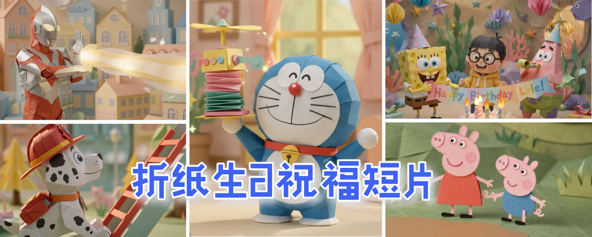
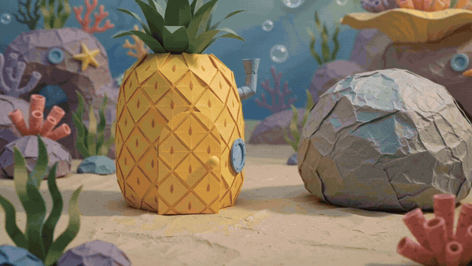
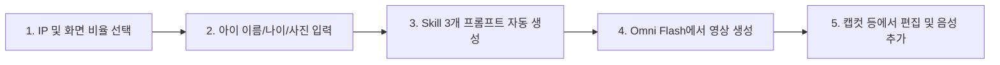

<div align="center">

[简体中文](README.md) · [English](README.en.md) · [日本語](README.ja.md) · [**한국어**](README.ko.md) · [Español](README.es.md)

# 🎂 Kid Papercraft (어린이 종이접기 스톱모션 생일 영상 생성기)

### 인기 애니메이션 영웅들과 함께, 우리 아이를 위한 따뜻하고 마법 같은 30초 종이접기 스톱모션 생일 영상을 만들어보세요.

크리에이터와 부모님을 위한 오픈소스 AI Skill. 아이의 이름, 나이, 사진 또는 외모 특징만 입력하면 **Gemini Omni Flash** 모델에 최적화된 3막 구성의 스톱모션 프롬프트와 캐릭터 맞춤형 보이스오버 대본을 생성합니다.


<br/>



<br/>

활용 분야: **아이 생일 축하 영상, 가족 모임 공유, 릴스 / 쇼츠 / 틱톡 어린이 숏폼 콘텐츠 제작**.

</div>

---

## ✨ 핵심 기능

- 🎭 **5대 인기 애니메이션 IP 종이접기화**: 네모바지 스폰지밥, 페파피그, 울트라맨, 퍼피 구조대, 도라에몽.
- ⏱️ **30초 황금 3막 스토리 구조 (10초 × 3개 클립)**:
  - **1막 (0–10초) 유쾌한 등장**: 캐릭터들이 접힌 종이 속에서 재미있게 튀어나오며 시선 집중.
  - **2막 (10–20초) 생일 축하 파티**: 촛불이 켜진 케이크와 현수막을 들고 아이의 맞춤형 종이 인형과 함께 축하.
  - **3막 (20–30초) 따뜻한 생활습관 당부**: 양치하기 🪥, 일찍 자기 😴, 밥 잘 먹기 🍽️ 미니 애니메이션.
- 👶 **나만의 아이 종이 인형 아바타**: 아이의 외모 묘사 적용 및 Reference Image(참고 사진) 입력 지원.
- 📐 **화면 비율 최적화**: `9:16` (스마트폰 세로 숏폼) 및 `16:9` (TV/태블릿 가로 모드).
- 🎙️ **캐릭터 더빙/자막 대본 제공**: 캐릭터 성격에 맞춘 대사 스크립트 포함.

---

## 🎬 지원하는 5대 애니메이션 IP

| # | 애니메이션 IP | 대표 캐릭터 | 종이접기 배경 테마 |
|:---:|:---|:---|:---|
| 🧽 | **스폰지밥** | 스폰지밥 & 뚱이 | 파인애플 하우스와 종이 산호초 |
| 🐷 | **페파피그** | 페파 & 조지 | 종이 잔디 언덕과 진흙 웅덩이 |
| ⭐ | **울트라맨** | SD 울트라맨 & 아기 괴수 | 노을빛 미니어처 종이 도시 |
| 🐶 | **퍼피 구조대** | 체이스 & 마샬 | 종이 구조 마을과 강아지 집 |
| 🤖 | **도라에몽** | 도라에몽 & 진구 | 신기한 종이 비밀도구가 가득한 방 |

---

## 📋 프롬프트 생성 예시 (스폰지밥 5세 생일)

<div align="center">
  <a href="assets/readme/spongebob-birthday-demo.mp4">
    
  </a>
  <p><em>🎬 스폰지밥 테마 · 30초 종이접기 생일 영상 데모（<strong>GIF를 클릭하면 소리가 포함된 풀 HD 비디오가 열립니다</strong>）</em></p>
</div>

### 🎬 Clip 1: 등장 장면 (0–10s)
```text
Charming stop-motion animation of an origami ocean world. Beautifully textured colored paper cutouts of SpongeBob SquarePants and Patrick Star made of origami, popping out of a folding paper pineapple house and a paper rock, doing a silly dance and bumping into each other, laughing joyfully. Paper bubbles float up around them. Warm organic lighting, tactile paper textures, gentle camera pan, soft pastel color palette, whimsical and cozy atmosphere.
```

### 🎬 Clip 2: 생일 파티 (10–20s)
```text
Charming stop-motion animation in a colorful origami underwater party room with paper coral and seaweed decorations. Beautifully textured colored paper cutouts of origami SpongeBob SquarePants and Patrick Star wearing paper party hats and blowing paper horns standing together with a cute small origami paper child (a cheerful boy with a round face, short black hair, black-rimmed glasses, and a cozy yellow hoodie), all gathered around a large origami birthday cake with 5 paper candles glowing softly. The characters hold up a folding paper banner that reads "Happy Birthday Lele!". Paper confetti and tiny origami stars fall gently from above. Warm organic lighting, tactile paper textures, gentle camera pan, soft pastel color palette, whimsical and cozy atmosphere.
```

### 🎬 Clip 3: 생활 습관 당부 (20–30s)
```text
Charming stop-motion animation montage in SpongeBob's origami pineapple house interior. Beautifully textured colored paper cutouts showing three quick adorable scenes: First, the cheerful origami SpongeBob cheerfully brushing teeth with a tiny origami toothbrush, with sparkles of paper glitter around the smile. Then, the cheerful origami SpongeBob yawning cutely and tucking into a cozy origami paper bed with a paper star nightlight. Finally, the cheerful origami SpongeBob happily eating from a colorful origami paper plate with tiny paper vegetables and rice. Each scene transitions with a gentle paper fold wipe. Warm organic lighting, tactile paper textures, gentle camera pan, soft pastel color palette, whimsical and cozy atmosphere.
```

---

## 🛠️ 제작 워크플로우 (Workflow)



---

## 📦 설치 및 실행

```bash
git clone https://github.com/kaomei/kid-papercraft.git
cd kid-papercraft

# Antigravity / Gemini CLI
cp -R skills/kid-papercraft ~/.gemini/config/skills/kid_papercraft

# Codex CLI
cp -R skills/kid-papercraft "${CODEX_HOME:-$HOME/.codex}/skills/kid_papercraft"
```

대화창에서 호출:
```text
우리 아이를 위한 종이접기 생일 축하 영상을 만들어줘!
```

---

## ⚠️ 면책 조항 및 지적재산권 안내 (Disclaimer)

1. **비공식 프로젝트 안내**: 본 오픈소스 프로젝트(`kid-papercraft`)는 AI 프롬프트 엔지니어링 템플릿 도구이며, **본문에 언급된 애니메이션 제작사, 판권 소유자 및 공식 브랜드와 어떠한 상업적 제휴나 후원 관계도 없습니다**.
2. **지적재산권 귀속**: 언급된 모든 애니메이션 캐릭터, 명칭(스폰지밥, 페파피그, 울트라맨, 퍼피 구조대, 도라에몽 등)의 상표권 및 저작권은 각 원작자 및 권리자에게 귀속됩니다.
3. **사용 범위**: 제공되는 프롬프트는 개인 학습, 기술 연구, AI 생성 예술 탐구 및 **비상업적 가족 생일 축하 영상 제작** 목적으로만 사용해야 합니다.

---

## 🤝 기여 안내

새로운 애니메이션 IP 템플릿 추가 및 프롬프트 개선 PR을 환영합니다!

이 프로젝트가 아이와 가족에게 특별한 추억을 선물했다면, **Star ⭐️를 눌러 kaomei(烤妹儿)를 응원해주세요!**

## 📄 라이선스

[MIT License](LICENSE) © 2026 [kaomei](https://github.com/kaomei)
