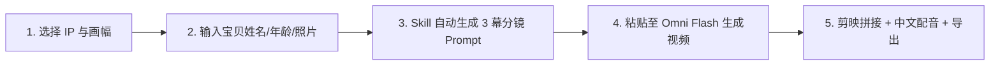

<div align="center">

[**简体中文**](README.md) · [English](README.en.md) · [日本語](README.ja.md) · [한국어](README.ko.md) · [Español](README.es.md)

# 🎂 Kid Papercraft (萌宝纸艺生日祝福生成器)

### 用热门动画英雄，为孩子定制 30 秒充满温度与魔法的定格折纸生日大片

一款面向创作者与家长的开源 AI Skill。只需输入宝贝的名字、年龄、照片或外貌特征，即可基于 **Gemini Omni Flash** 模型生成三段式经典定格动画分镜提示词与中文角色配音脚本。


<br/>


<br/>

适用于：**宝宝生日祝福定制、家庭聚会社交分享、小红书/抖音/视频号/TikTok 儿童短剧与祝福视频创作**。

</div>

---

## ✨ 核心亮点

- 🎭 **5 大殿堂级童年 IP 折纸化**：海绵宝宝、小猪佩奇、奥特曼、汪汪队、哆啦A梦，全套手作折纸定格质感。
- ⏱️ **30 秒黄金三段式剧情架构（3 个 10 秒片段）**：
  - **第 1 幕（0–10s）创意出场**：角色以趣味定格动作破纸而出，迅速抓住小朋友眼球。
  - **第 2 幕（10–20s）生日祝福**：角色与宝贝的折纸小人围绕生日蛋糕，高举定制横幅与发光蜡烛。
  - **第 3 幕（20–30s）暖心叮嘱**：角色快剪演示生活好习惯（认真刷牙 🪥、按时睡觉 😴、乖乖吃饭 🍽️）。
- 👶 **定制专属宝宝折纸形象**：支持文字描述宝宝外貌特征，并支持上传宝宝照片作为 Reference Image（参考图）。
- 📐 **自适应多端比例**：支持 `9:16`（手机竖屏/视频号/抖音/Shorts）与 `16:9`（横屏电视/平板/投影）。
- 🎙️ **配套中文配音与台词脚本**：针对不同 IP 角色性格提供中文配音与字幕参考，剪映一键对齐。

---

## 🎬 支持的 5 大动画 IP 阵容

| # | 动画 IP | 主角阵容 | 折纸主题场景 |
|:---:|:---|:---|:---|
| 🧽 | **海绵宝宝** | 海绵宝宝 & 派大星 | 折纸比奇堡菠萝屋与彩色纸珊瑚礁 |
| 🐷 | **小猪佩奇** | 佩奇 & 乔治 | 折纸草地泥坑与野餐派对 |
| ⭐ | **奥特曼** | Q版红银英雄 & 友好小怪兽 | 晚霞微缩折纸城市天际线 |
| 🐶 | **汪汪队立大功** | 阿奇 (Chase) & 毛毛 (Marshall) | 折纸救援小镇与折纸狗窝 |
| 🤖 | **哆啦A梦** | 哆啦A梦 & 大雄 | 充满神奇折纸道具的温馨书房 |

---

## 📋 提示词生成范例（以海绵宝宝 5 岁生日为例）

<div align="center">
  <a href="assets/readme/spongebob-birthday-demo.mp4">
    
  </a>
  <p><em>🎬 海绵宝宝主题 · 乐乐 5岁生日定格折纸动画生成样片（<strong>点击动图可直接打开带声音高清视频</strong>）</em></p>
</div>

### 🎬 Clip 1: 创意出场 (0–10s)
> **台词参考**：（海绵宝宝笑声）“哈哈哈~ 派大星你看！今天是个特别的大日子！”

```text
Charming stop-motion animation of an origami ocean world. Beautifully textured colored paper cutouts of SpongeBob SquarePants and Patrick Star made of origami, popping out of a folding paper pineapple house and a paper rock, doing a silly dance and bumping into each other, laughing joyfully. Paper bubbles float up around them. Warm organic lighting, tactile paper textures, gentle camera pan, soft pastel color palette, whimsical and cozy atmosphere.
```

### 🎬 Clip 2: 生日祝福 (10–20s)
> **台词参考**：“祝乐乐 5 岁生日快乐！🎉 愿你每天都像在比奇堡一样开开心心！”

```text
Charming stop-motion animation in a colorful origami underwater party room with paper coral and seaweed decorations. Beautifully textured colored paper cutouts of origami SpongeBob SquarePants and Patrick Star wearing paper party hats and blowing paper horns standing together with a cute small origami paper child (a cheerful boy with a round face, short black hair, black-rimmed glasses, and a cozy yellow hoodie), all gathered around a large origami birthday cake with 5 paper candles glowing softly. The characters hold up a folding paper banner that reads "Happy Birthday Lele!". Paper confetti and tiny origami stars fall gently from above. Warm organic lighting, tactile paper textures, gentle camera pan, soft pastel color palette, whimsical and cozy atmosphere.
```

### 🎬 Clip 3: 暖心叮嘱 (20–30s)
> **台词参考**：“乐乐已经是 5 岁的大孩子啦！新的一岁，要好好刷牙🪥、按时睡觉😴、还要乖乖吃饭🍽️哦！”

```text
Charming stop-motion animation montage in SpongeBob's origami pineapple house interior. Beautifully textured colored paper cutouts showing three quick adorable scenes: First, the cheerful origami SpongeBob cheerfully brushing teeth with a tiny origami toothbrush, with sparkles of paper glitter around the smile. Then, the cheerful origami SpongeBob yawning cutely and tucking into a cozy origami paper bed with a paper star nightlight. Finally, the cheerful origami SpongeBob happily eating from a colorful origami paper plate with tiny paper vegetables and rice. Each scene transitions with a gentle paper fold wipe. Warm organic lighting, tactile paper textures, gentle camera pan, soft pastel color palette, whimsical and cozy atmosphere.
```

---

## 🛠️ 创作工作流 (Workflow)



1. **唤醒技能**：确认竖屏（9:16）或横屏（16:9），选择孩子喜爱的动画 IP。
2. **个性化输入**：输入宝宝姓名、年龄、形象特征（可选上传宝宝正面照片）。
3. **获取分镜 Prompt**：生成 3 个独立且锁定了风格质感的 Omni Flash 提示词与配套台词。
4. **视频生成**：复制提示词到 **Gemini Omni Flash** 中生成 3 个 10 秒片段。
5. **剪辑成片**：导入剪映拼接为 30 秒完整视频，配上随附的角色语音台词与欢快音效。

---

## 📦 安装与使用

### 在 Antigravity / Gemini CLI / Codex 中安装：

克隆本项目仓库：

```bash
git clone https://github.com/kaomei/kid-papercraft.git
cd kid-papercraft
```

将技能文件复制到你的自定义 skills 目录：

```bash
# Antigravity / Gemini CLI
cp -R skills/kid-papercraft ~/.gemini/config/skills/kid_papercraft

# Codex CLI
cp -R skills/kid-papercraft "${CODEX_HOME:-$HOME/.codex}/skills/kid_papercraft"
```

在对话中随时输入：

```text
帮我做一个折纸风格的生日祝福视频！
```

---

## ⚠️ 免责声明与版权提示 (Disclaimer)

1. **非官方声明**：本项目（`kid-papercraft`）为一个开源的 AI 提示词工程模板与 Skill 工具，**与文中所提及的任何动画制作公司、版权方或品牌官方均无任何商业合作、赞助或关联**。
2. **知识产权归属**：文中所涉及的动画形象、角色名称（包括但不限于海绵宝宝、小猪佩奇、奥特曼、汪汪队立大功、哆啦A梦等）及其衍生设计之所有知识产权与商标权，均归属于各自原始版权持有方所有。
3. **用途限定**：本 Skill 生成的提示词模板仅供个人学习、技术研究、AI 生成艺术探索及**非商业性质的家庭个人生日祝福**使用。请勿将生成的受版权保护角色素材用于商业化盈利或侵权用途，使用者需自行承担因违规使用而产生的相关法律责任。

---

## 🤝 欢迎贡献

欢迎提交 PR 扩充更多动画 IP 模板、优化定格动画质感提示词或分享精美的生成范例。

如果这个项目为你的孩子或朋友带来了惊喜与感动，**请给项目点一个 ⭐️ Star 支持烤妹儿！**

## 📄 开源协议

[MIT License](LICENSE) © 2026 [kaomei](https://github.com/kaomei)
