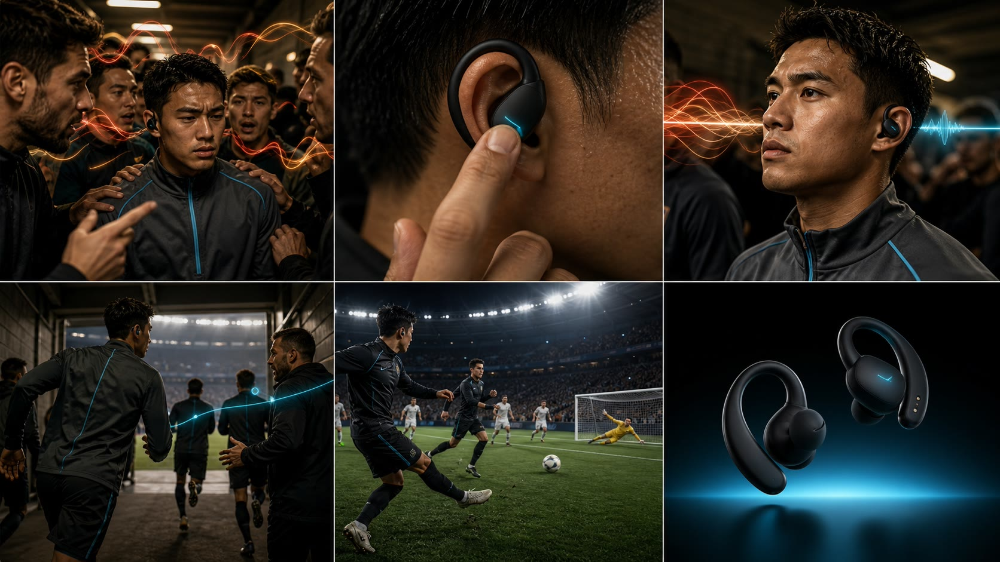

# replicate-video-ad 能力研究与热门广告结构迁移实验

> 把一条优秀参考视频从“灵感”转换为可追溯证据、可迁移叙事机制和可执行的新产品视频生产架构。

[在线案例](https://yydshly.github.io/0830_codex_project/demos/replicate-video-ad-demo/) · [研究门户](https://yydshly.github.io/0830_codex_project/) · [仓库总索引](../../README.md) · [上游仓库](https://github.com/Jingyi-Wu-Richael/replicate-video-ad)

## 结论

[`Jingyi-Wu-Richael/replicate-video-ad`](https://github.com/Jingyi-Wu-Richael/replicate-video-ad) 不是视频生成模型，也不是把原片直接交给生成模型“一键复刻”的工具。它更像一套面向大模型的视频广告分析与生产约束：先把参考片变成可复核证据，再把优秀的镜头因果、节奏关系与功能证明方式迁移成另一产品可独立执行的镜头规格。

结构冻结后，生成阶段原则上不再需要输入参考原片；但最终成片仍需要真实产品事实、产品与品牌资产、视频生成模型，以及剪辑、声音、字幕、Logo 与法务确认。

## 项目能力

| 能力 | 具体输出 | 解决的问题 |
|---|---|---|
| 视频证据抽取 | 视频参数、定时帧、故事板、接触表、时间戳 Manifest、音频 | 把“这个视频很好”变成可定位、可复核的观察证据 |
| 广告机制拆解 | 镜头节拍、剧情功能、因果链、功能证明方式 | 避免只得到“高级、电影感、炫酷转场”等空泛风格词 |
| 新产品结构迁移 | 保留机制、替换元素、连续性锚点、商品事实状态 | 学习原片的优秀表达，同时更换人物、场景、产品、品牌与文案 |
| 生成与后期约束 | 主提示词、分段 Prompt、负面约束、剪辑与声音计划 | 让不同视频模型或制作团队得到统一、可执行的生产规格 |
| A/B 评估 | 有 Skill / 无 Skill 的统一评分维度 | 衡量结构完整度、事实准确性、连续性、可剪辑率、返工和成本 |

能力边界：本项目交付的是“参考视频分析 + 新产品生产架构 + 概念分镜”，不是最终 MP4，也不承诺复刻原片的人物、画面、品牌系统、音乐或受保护表达。

## 技术原理

```text
一次性分析层                  可复用架构层                    生成执行层
参考视频                     证据 + 新产品事实               生产架构 + 产品资产
   │                                │                                │
   └→ 探测 / 抽帧 / 音频 / Manifest └→ 节拍 / 因果 / 主张 / Prompt └→ 分段生成 / 剪辑 / 声音 / 法务
                    参考原片退出生成流程 ─────────────────────────────→ 最终 MP4
```

1. **确定证据**：上游脚本用 FFmpeg / FFprobe 探测媒体，并按固定时间间隔生成帧、故事板、接触表、Manifest 与音频。
2. **抽象机制**：多模态大模型与 Skill 规则把画面事实转换为剧情功能，标出每一拍“为什么存在”以及它如何推进下一拍。
3. **迁移结构**：保留因果、节奏和证明方式；替换人物、产品、场景、造型、品牌、音乐与文案，并把商品宣称分为 observed / adaptation / placeholder。
4. **约束生成**：输出镜头时间线、连续性锚点、主 Prompt、分段生成计划、负面约束和后期位置，供视频模型与剪辑流程执行。
5. **独立验收**：评价重点从“像不像参考片”转为结构是否完整、商品是否真实、镜头是否连续、素材是否可剪辑。

大模型本身可以理解视频，也可以直接生成视频；这个 Skill 的增量是把分析与生成之间的证据、约束和交付格式固定下来，使结果更可追溯、更可复用，也更容易比较和返工。

## 使用场景

| 场景 | 如何使用这套能力 | 典型交付 |
|---|---|---|
| 产品发布片 | 参考成熟品牌的“问题—触发—证明—收口”结构，换成自己的真实产品 | 发布片镜头规格与生成包 |
| 电商功能广告 | 把优秀广告的功能证明方式迁移到新品或不同品类 | 15–35 秒转化型分镜与后期文案 |
| 系列化内容 | 从多条参考片提取稳定模式，为多个 SKU 共用 | 品牌镜头语法与可复用模板 |
| 创意提案与供应商交接 | 把口头参考转成带时间线、事实边界和连续性要求的 Brief | 可审阅的生产架构与资产清单 |
| 模型或工作流评测 | 在同预算下对比泛化提示词与结构化生产包 | A/B 评分、返工次数、耗时与成本记录 |
| 组织知识沉淀 | 持续累积优秀案例的表达机制，而不是保存“照抄提示词” | 参考片模式库、模板库和质量基线 |

不适合的用途包括：未获授权的逐镜头复制、名人或品牌仿冒、在没有产品事实时编造性能参数，以及期待只靠本库直接输出最终视频。

## 后期价值

- **模型无关的生产中间层**：未来更换视频模型，仍可复用同一份证据、结构与验收规格。
- **从单案例升级为模式库**：积累产品证明、发布、前后对比、情绪品牌和电商转化等不同叙事模式。
- **降低返工与事实风险**：连续性锚点和商品宣称状态能更早暴露不一致、幻觉和法务问题。
- **支持自动化流水线**：后续可把“任务输入 → 抽帧 → 分析骨架 → 生产架构 → 验证”脚手架化。
- **形成团队评估基线**：用同一套指标比较不同模型、提示策略、预算与供应商，而不是只凭主观审美判断。

当前成熟度：视频证据抽取、结构分析、生产规划、静态网页展示与离线验证已经完成；“Skill 是否稳定提升最终成片”仍需使用真实产品、同一视频模型和相同预算完成正式 A/B 成片实验。

## 项目与文档索引

| 入口 | 内容 |
|---|---|
| [在线交互案例](https://yydshly.github.io/0830_codex_project/demos/replicate-video-ad-demo/) | 原片证据、六段机制、新产品分镜与有 / 无 Skill 对比 |
| [研究门户](https://yydshly.github.io/0830_codex_project/) | 0830 Research Lab 的所有研究项目 |
| [统一理解与方法论](docs/从参考视频到新产品视频架构.md) | 三层能力模型、术语、11 步工作流与职责边界 |
| [能力沉淀与复用指南](docs/能力沉淀与复用指南.md) | 后续项目如何使用本库，哪些资产可复用、哪些事实必须重填 |
| [新任务输入模板](templates/任务输入模板.md) | 参考片、产品事实、品牌资产、渠道、预算与模型条件 |
| [视频生产架构模板](templates/视频生产架构模板.md) | 可脱离参考原片执行的标准生产规格 |
| [A/B 评估模板](templates/A-B评估模板.md) | 有 Skill / 无 Skill 的质量、成本与返工对照 |
| [完整结构迁移生产包](web/downloads/real-case-replication-pack.md) | Relay Arc 案例的主 Prompt、分段计划、负面约束与后期方案 |
| [来源快照](web/downloads/real-case-source.json) / [证据 Manifest](web/downloads/source-frame-manifest.json) | 真实案例来源、时间戳与筛选帧记录 |
| [上游依赖与获取](docs/上游依赖与获取.md) | 上游 URL、固定提交、许可边界与本地获取方式；公开仓库不再分发上游源码 |

## 真实案例

本项目用一条 [Apple 官方 AirPods Pro 3 广告](https://www.youtube.com/watch?v=wDgH0FECdJs) 作为真实输入。2026-08-30 抓取快照为 35 秒、6,309,443 次播放。输出不是照抄原片，而是一条原创虚构产品“Relay Arc · AI 实时翻译运动耳机”的发布片架构与概念分镜。

```text
参考视频（一次性研究输入）
→ 抽帧证据与剧情功能
→ 可复用的新产品视频生产架构
→ 视频模型分段生成 + 后期剪辑
→ 最终成片
```

复用的是方法、代码、栏目和质量标准；必须重新填写的是参考视频、目标产品、真实事实、品牌素材、渠道、预算和模型条件。



## 真实案例展示了什么

| 阶段 | 原片证据 | 提取机制 | 新产品迁移 |
|---|---|---|---|
| 佩戴触发 | 耳机先于文案出现 | 用一个动作建立状态切换 | 球员在多语言压力中触碰黑色挂耳设备 |
| 状态释放 | 人物从静坐变为舞动 | 抽象能力转成可观察的身体变化 | 混乱声波收束成一条清晰语义流 |
| 空间推进 | 房间进入走廊 | 人物、设备、运动方向保持连续 | 同一球员穿过通道，把理解带入任务 |
| 难度加压 | 更大空间、更快速度、更多干扰 | 环境越难，能力越显得有意义 | 进入多人高速比赛协作 |
| 结果证明 | 人群与车辆中保持自己的节奏 | 先给可见结果，后命名主张 | 同步传跑与进球证明“听懂了” |
| 产品收口 | ANC 主张与产品锁定 | 情绪完成后交给商品记忆 | 原创设备英雄镜头，事实文案后期加入 |

Web 页面把每一拍做成“原片关键帧 / 抽象机制 / 新片分镜”三列交互，并列展示 Without Skill 与 With Skill 的输出差异。

## 实际运行证据

真实原片只进入本机临时研究目录，没有提交到仓库。上游抽帧器在固定提交 `e143d2a7bc0d7c684b8164291799fe1ff48ed7dc` 上实际运行，得到：

- 视频探测：35.061 秒、1280×720、23.976 fps；
- 高密度抽帧：2 fps、0.5 秒间隔、70 张 JPEG；
- 浏览证据：12 帧故事板与 6 页接触表；
- 可追溯数据：JSON / CSV 时间戳 Manifest；
- 音频准备：单声道 16 kHz MP3；
- Web 只保留 6 张 640×360 低清证据帧和一张采样故事板。

[浏览已筛选的证据 Manifest](web/downloads/source-frame-manifest.json)

## 项目结构

```text
replicate-video-ad-demo/
├─ demo/                             # 合成片生成、上游抽帧调用与离线验证
├─ artifacts/
│  ├─ extractor-output/             # 第一版无版权合成片的完整抽帧证据
│  ├─ 视频复刻提示词.md              # 第一版 Skill 输出
│  └─ 热门广告复刻案例.md            # 真实热门案例索引
├─ docs/
│  ├─ 从参考视频到新产品视频架构.md   # 三层能力模型、工作流和术语边界
│  ├─ 能力沉淀与复用指南.md           # 后续项目如何直接复用本库能力
│  └─ 上游依赖与获取.md               # 固定提交、许可边界与本地获取方式
├─ templates/
│  ├─ 任务输入模板.md                 # 新任务需要重新填写的事实与条件
│  ├─ 视频生产架构模板.md             # 可脱离原片执行的标准交付格式
│  └─ A-B评估模板.md                  # 有 Skill / 无 Skill 的对照评估
├─ web/
│  ├─ assets/source/                # 真实原片有限低清研究帧
│  ├─ assets/adaptation/            # 原创新产品概念分镜
│  ├─ downloads/                    # 来源快照、Manifest、生产包
│  ├─ index.html
│  ├─ styles.css
│  └─ app.js
├─ project.json
└─ README.md
```

## 有 Skill 与没有 Skill

没有 Skill，大模型也能产出“运动员戴耳机、炫酷转场、最后展示产品”的泛化提示词，但容易丢失镜头因果、时间证据、连续性和商品事实边界。

使用 Skill 后，输出固定包含：六段时间线、每段剧情功能、保留与替换项、连续性锚点、observed / adaptation / placeholder 三种宣称状态、主提示词、负面约束和四段生成计划。真正值得研究的是这种约束能否降低返工，而不是它是否能替代视频模型。

生成阶段建议只输入“生产架构 + 产品事实 + 产品资产”，默认不再输入原片。评估标准也应从“像不像参考片”改为“结构是否完整、产品是否真实、镜头是否连续、素材是否可剪辑”。

## 复现与验证

要求：Python 3.10+、FFmpeg 与 FFprobe。上游源码不会随本项目公开再分发；运行抽帧器前请按 [《上游依赖与获取》](docs/上游依赖与获取.md) 在本地准备已获授权的脚本。

```powershell
cd projects/replicate-video-ad-demo
python demo/verify_demo.py
```

重新运行上游抽帧器时，输入必须是本地文件路径，输出目录必须是新目录或空目录：

```powershell
./demo/run_extractor.ps1 -InputPath path/to/authorized-reference.mp4 -OutputDir artifacts/replay-output
```

## 版权与商品事实边界

- 完整参考视频不在仓库中；Web 通过官方 YouTube 播放器访问原片。
- 低清关键帧仅用于评论、研究和结构说明；商业使用应获得相应授权。
- 新方案不使用 Vini Jr. 或其他名人肖像，不复制 Apple 标识、AirPods 工业设计、原片音乐、文案和具体镜头。
- 原片的 ANC 主张只作为 observed 事实记录，不迁移到虚构产品。
- 翻译准确率、延迟、支持语言数、续航与上市信息全部保留占位符，必须由真实商品证据和法务确认。
- 上游仓库在获取时没有 `LICENSE` 文件，因此本项目的远端提交不包含其源码快照；使用或再分发前需核对当前许可并在必要时向作者确认授权。

## 下一步研究

1. 用同一视频生成模型与相同预算做 A/B：A 组参考原片写一句泛化提示词；B 组不输入原片，只输入本生产包、真实产品事实与产品资产。
2. 盲评镜头因果完整度、人物 / 商品连续性、宣称幻觉、可剪辑率、返工次数与总生成成本。
3. 增加镜头边界检测、OCR 和带时间戳 ASR，衡量 2 fps 对闪切和字幕的遗漏。
4. 在取得授权并配置视频 API 后生成两组成片，验证 Skill 是否带来统计意义上的稳定提升。
