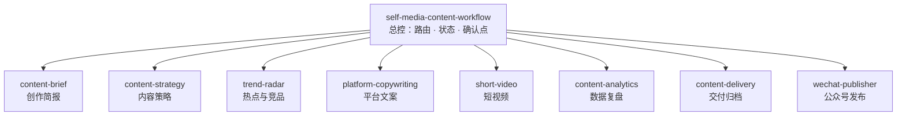

# Self Media Skills

[](https://github.com/yanhua1010/self-media-content-workflow/actions/workflows/validate.yml)
[](LICENSE)
[](CHANGELOG.md)

**简体中文** | [English](README.en.md)

一套通用、模块化的自媒体内容生产与经营 Agent Skills：从模糊需求到创作简报、账号策略、热点与竞品研究、平台原生文案、短视频方案、数字人视频制片、公众号排版发布、数据复盘和交付归档，覆盖内容生产的完整闭环。

- **工具无关** — 不绑定特定模型、浏览器、图片、视频、发布或数据服务，运行时自动发现当前环境的可用能力
- **平台原生** — 同一母题共享事实与证据，为每个平台分别设计标题、开头、结构和行动
- **人工在环** — 方向、平台、标题、终稿、发布授权五个强制确认点，默认只产出草稿或发布包，从不自动群发
- **证据优先** — 关键数字必须有来源，区分事实、判断、推断与建议，不编造数据、体验和收益
- **视觉体系化** — 内置 8 套配图风格预设与平台路由，先选风格再出图，同组不混用，账号偏好优先于预设默认值

数字人制片中，头像与声音素材由用户在了解所选服务商当前数据处理条款后，亲自在该平台上传、创建并选定。任务文件、注册表和仓库不保存原始头像或录音、其本机路径、临时链接及平台私有标识，只索引数字人生成片段、最终视频、字幕文件等交付物的路径。

## 架构



| Skill | 职责 |
|---|---|
| [`self-media-content-workflow`](skills/self-media-content-workflow/SKILL.md) | 请求路由、状态管理、确认点和端到端编排 |
| [`self-media-content-brief`](skills/self-media-content-brief/SKILL.md) | 澄清目标、受众、证据、角度和约束 |
| [`self-media-content-strategy`](skills/self-media-content-strategy/SKILL.md) | 账号定位、内容配比、栏目、选题池和内容日历 |
| [`self-media-trend-radar`](skills/self-media-trend-radar/SKILL.md) | 热点追踪、关键词研究、竞品拆解和原创选题 |
| [`self-media-platform-copywriting`](skills/self-media-platform-copywriting/SKILL.md) | X、小红书、公众号和短视频平台原生文案，含配图风格库 |
| [`self-media-short-video`](skills/self-media-short-video/SKILL.md) | 钩子、口播、分镜、字幕、拍摄方案和可选数字人制片 |
| [`self-media-content-analytics`](skills/self-media-content-analytics/SKILL.md) | 数据质量、基线比较、归因、决策和实验 |
| [`self-media-content-delivery`](skills/self-media-content-delivery/SKILL.md) | 里程碑保存、版本、路径核验和完整发布包 |
| [`self-media-wechat-publisher`](skills/self-media-wechat-publisher/SKILL.md) | 公众号排版、图片上传、草稿箱写入和小绿书图片消息 |

## 快速开始

### 安装

**Claude Code 用户（推荐，无需 Node.js）**

在 Claude Code 中依次执行两条命令，一次装齐全部 9 个 Skill：

```text
/plugin marketplace add yanhua1010/self-media-content-workflow
```

```text
/plugin install self-media-suite@self-media
```

**其他 Agent（Codex、Cursor 等）**

使用官方 [skills CLI](https://github.com/vercel-labs/skills)（需要 Node.js）：

```bash
# 安装全部 9 个 Skill 到当前项目
npx skills add yanhua1010/self-media-content-workflow

# 安装到用户全局目录
npx skills add yanhua1010/self-media-content-workflow -g
```

按需选装模块，或用 `-a` 指定目标 Agent：

```bash
npx skills add yanhua1010/self-media-content-workflow --skill self-media-content-workflow -a claude-code
```

### 第一个任务

从总控 Skill 开始，它会自动路由到需要的模块：

```text
使用 $self-media-content-workflow，把这段产品失败经历做成小红书和公众号内容。
```

也可以直接调用单个模块：

```text
使用 $self-media-content-strategy，为一个新账号建立选题池和一个月内容日历。

使用 $self-media-trend-radar，研究最近一个月 AI 编程内容的高频问题。

使用 $self-media-content-analytics，分析这 10 篇内容并找出下一轮唯一实验。
```

> Skill 的具体引用语法以所用 Agent 为准。

## 工作流

```text
需求澄清 → 方向确认* → 研究与证据 → 平台确认* → 发布预检
→ 平台原生初稿 → 标题确认* → 素材生成（真人/数字人） → 质量审校
→ 终稿确认* → 发布授权* → 草稿或发布包 → 数据复盘
```

`*` 为强制人工确认点。终稿确认不等于发布授权：Skill 默认只创建草稿或手动发布包，不直接群发。

素材生成前，工作流从[配图风格库](skills/self-media-platform-copywriting/references/visual-styles.md)按内容类型和平台推荐 2 到 3 套风格供选择，账号已有稳定偏好时直接沿用。

## 安全边界

- 不使用主账号登录态自动采集竞品
- 不自动点赞、评论、关注、私信或发布
- 不在任务卡、日志或仓库保存 Cookie、Token 和 Secret
- 数字人头像、肖像和声音必须有使用权利；由用户本人在所选平台手动上传和选定，并在上传前了解平台当前的数据处理条款
- 任务卡、内容注册表和仓库不保存原始头像、录音及其本机路径、临时链接或数字人平台私有标识，只记录生成片段、成片和字幕等交付物的索引路径；按目标平台确认必要的 AI/数字人披露
- 验证码、限流和平台风控出现时立即停止
- 近期产品、价格、版本和平台规则优先核验官方来源
- 不编造数据、体验、收益、用户评价和测试结果

完整安全策略见 [SECURITY.md](SECURITY.md)。

## 校验

```bash
python3 scripts/validate.py
```

校验器检查 Skill frontmatter、目录一致性、核心文件行数、UI 元数据、相对链接和未处理的 TODO，无第三方依赖。CI 在每次提交时运行结构校验，并用官方 skills CLI 执行一次真实安装测试。

## 仓库结构

```text
skills/                   # 9 个可独立安装的 Skill
├── <skill>/SKILL.md      #   核心流程（≤ 500 行）
├── <skill>/references/   #   平台细则与详细规范
└── <skill>/assets/       #   可复制的输出模板
scripts/validate.py       # 仓库结构校验
.claude-plugin/           # Claude Code plugin 与 marketplace 清单
.github/workflows/        # 结构校验 + 安装测试
```

## 设计取舍

- 一个总控负责路由与状态，八个模块各承担单一职责
- 采集和发布作为运行时适配层，不绑定厂商实现
- 多平台共享事实与证据，但分别重写标题、开头、结构和行动
- 平台限制可能变化，需要精确值时以官方说明或发布界面为准

## 贡献

欢迎 Issue 和 Pull Request。提交前请阅读 [CONTRIBUTING.md](CONTRIBUTING.md)，并运行 `python3 scripts/validate.py`。版本记录见 [CHANGELOG.md](CHANGELOG.md)。

## 免责声明

本项目是一套内容创作辅助 Skills，按「现状」提供，不附带任何明示或默示的担保。使用前请注意：

- **平台规则以官方为准。** 仓库中的平台规范、发布流程和运营建议均为编写时的经验总结，平台规则随时可能调整。需要精确值时，请以平台官方公告和当前发布界面为准。
- **账号操作风险自担。** 本项目涉及公众号草稿写入等真实账号操作。因使用本项目而导致的账号限流、封禁、内容删除、数据丢失或其他损失，作者不承担责任。
- **凭据由你自己保管。** 本项目不收集、不传输、不存储任何凭据。`WECHAT_APP_ID`、`WECHAT_APP_SECRET` 等敏感信息仅通过你本地的环境变量提供，请勿写入任何会被提交或分享的文件。
- **内容合规由发布者负责。** 仓库提供的合规检查清单不构成法律意见。所发布内容是否符合《中华人民共和国广告法》等法律法规及各平台社区规范，由发布者自行判断并承担责任。
- **不保证效果。** 本项目不对内容的阅读量、涨粉、转化或收益作任何承诺。

## 许可证

[MIT](LICENSE)
